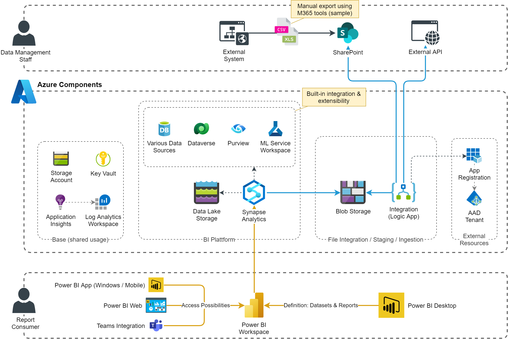

# Analytics Platform
This blueprint contains a Synapse Workspace, integrated with various data sources and potentially ML-based data enrichements. This realizes an enterprise wide, central BI data infrastructure to efficently provide Power BI workspaces with pre-processed data.

## Architecture

## Deployment
