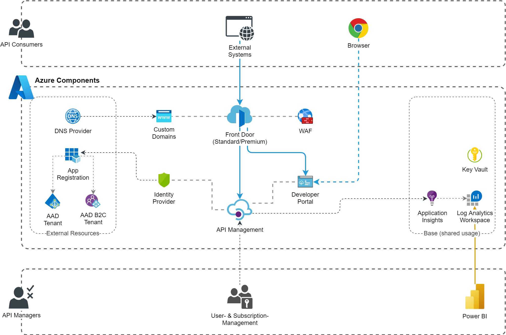
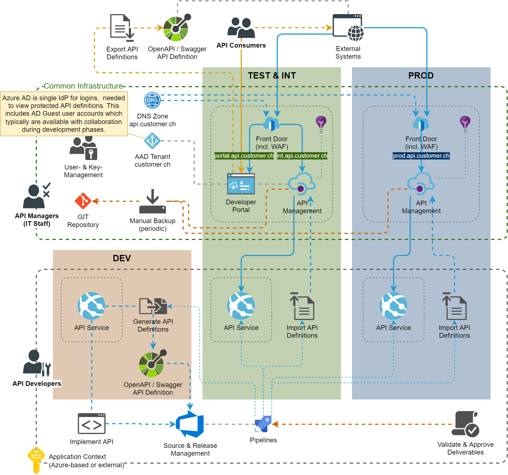

# Central API Management
With the popularity of the "API-First" philosophy, many companies want to be or become API-driven and demonstrate openness for ecosystems. One key part of that is often a central documentation and management of all API's available, including its accessibility. This may be central for the whole enterprise or for departments of it. There is also quite a lot of pattern and blueprint documentation of how to concept such a solution, for example the [Enterprise Integration article in the Azure Architecture Center](https://docs.microsoft.com/en-us/azure/architecture/reference-architectures/enterprise-integration/basic-enterprise-integration).

## Architecture

## Implementation Notes
### Front Door / API Management Integration
Microsoft documentation and available samples typically propose an integration based on virtual networks (VNET) and accessibility restrictions based on that (e.g. [Azure security baseline for API Management](https://docs.microsoft.com/en-us/security/benchmark/azure/baselines/api-management-security-baseline)).
There are two problems with this:
1. For API Management, only `Developer` and `Premium` tiers integrate with a VNET and the Private Link support in Front Door is only available in the `Premium` tier. The `Developer` tier should not be used in production scenarios (e.g. it has no SLA) and the `Premium` tiers are so expensive that this is not realistic for low to medium company use cases.
1. Today's PaaS application architectures rarely work with VNETs, so this feels unnatural. A proper implementation would require consistent handling of network security across all integrated applications, which is rather unrealistic.

This blueprint implements a simplified, cost efficient solution: An API Management policy on the root level validates, that the traffic comes from the correct Front Door instance by evaluating the secret Front Door identifier transmitted in the HTTP header of each request.

### Custom Domains
This is another pain point when placing API management behind a front door (or other entry service) with a lack of support from built-in functionality. Custom Domains must be defined in Front Door, which also have the great free managed certificate support. This impacts following features of API Management:
* Open Developer Portal directly from the Azure Portal with admin user (well, this is no problem as that perfectly runs with the standard URL).
* Test API methods in the built-in API designer.
* Gather API specification for code-generation including the host URI. And test API methods directly in the Developer Portal.

The latter two fail because the traffic is not routed via Front Door and the wrong host URL is displayed. The parallel configuration of the same custom domains in the API Management will fail, except when you also provide a custom certificate (pfx file). This is a huge loss of comfort and you would need to setup a complex workflow to automatically provision and renew the certificate (and by the way, [with the `Developer` tier, the automatic renewal of the certificate with its update in the Key Vault won't work](https://docs.microsoft.com/en-us/azure/api-management/configure-custom-domain?tabs=key-vault#domain-certificate-options)). Of course you could trick it by assigning the domain to API Management first and then to Front Door, but this is only temporary, as it will be unnassigned on the next deployment or when the certificate would have to be renewed.

Again, to much effort and complexity for low to medium company use cases. This blueprint provides a workaround with an APIM policy and Front Door rule, that automatically redirects traffic in these 2 use cases in a way so that no CORS problems occur in the Developer Portal. Still, in the developer portal displays the wrong host URL, but that can be explained to users within a "Getting Started" page that usually needs to be provided anyway.

### Developer Portal Instances
Yet another challenge. At the moment there is simply no real-world method to manage multiple instances with an automatable process and keep them in sync. The only way to gather developer portal contents (i.e. page definitions) is via iteration thru a bunch of API calls (well, there are [PowerShell scripts provided in the official developer portal repo](https://github.com/Azure/api-management-developer-portal/tree/master/scripts.v3)). Considering the user experience, it can also be challenged if its good to have environment-specific developer portals or not.

The most appropriate solution may be in many situations, to provide the developer portal solely based on the TEST / INT environment, and provide according documentation in it on how to access and use the PROD environment (mostly by just altering the host URL and knowing which versions are released and available on PROD).

Hint #1: [Provide user authentification to test APIs directly in Developer Portal](https://docs.microsoft.com/en-us/azure/api-management/api-management-howto-protect-backend-with-aad).

Hint #2: Support Guest AAD accounts for login in Developer Portal (available in `Developer` tier, which could be reasonable for TEST environments):
* [Setup according to Microsoft documentation](https://docs.microsoft.com/en-us/azure/api-management/api-management-howto-aad)
* Change App Registration to `Accounts in any organizational directory (Any Azure AD directory - Multitenant)`
* Ensure that `Signin tenant` in the APIM identity provider configuration is set to the directory id (Guid)

### CI/CD for API Definitions
The Microsoft documentation contains a possible [CI/CD concept based on Git repository processes](https://docs.microsoft.com/en-us/azure/api-management/devops-api-development-templates). Unfortunately, this is not well thought out and can hardly be automated in a meaningful way due to various functional limitations. The creation, validation and distribution of API definitions using the ARM fragments would be exceptionally complex and error-prone for software suppliers. However, the described possibility to download & upload the definition via Git can be used by the IT department for backup (and potentially restore) processes when wanted.

A more realistic and robust concept could be to separate the provisioning of the basic (management) resources and the API definitions as follows:

This ensures a consistent programming model based on OpenAPI specifications, which are either created manually or generated from code (with corresponding libraries or tools) and then are deployed as an integral part of the application CI/CD processes. Alternatively, the definitions can be created manually in the Azure Portal of the TEST environment and be exported as OpenAPI specification to source management.
The implementation of this process is the responsibility of the application supplier, the deployment of the OpenAPI spec can be done within [Bicep/ARM definitions](https://docs.microsoft.com/en-us/azure/templates/microsoft.apimanagement/service/apis), [CLI](https://docs.microsoft.com/en-us/cli/azure/apim/api), [PowerShell](https://docs.microsoft.com/en-us/powershell/module/az.apimanagement/import-azapimanagementapi) or with specific DevOps Pipeline Tasks in the marketplace ([Example](https://marketplace.visualstudio.com/items?itemName=stephane-eyskens.apim)). Microsoft provides a useful [DevOps Pipeline Task to generate OpenAPI spec for .NET applications](https://marketplace.visualstudio.com/items?itemName=ms-openapi.OpenApiDocumentTools).

## Recommendations
Provide integration guidelines for application developers (i.e. those who provide APIs), so that all APIs implement common patterns. This should contain definitions for:
* Responsabilities for changes in Developer Portal and user- & subscription-management.
* Versionning - we recommend that the built-in version set functionality of API Management with scheme `Path` (in URL) is consistently used. Specify how versions are named (e.g. `v{Major}.{Minor}` and `latest` for current development state on TEST environment) *.
* Responsabilities for removal (deprecation) of versions.
* Route (path) definitions, especially for top-level routes
* Patterns for operations (e.g. [RESTful web API design](https://docs.microsoft.com/en-us/azure/architecture/best-practices/api-design))
* Filtering, sorting, field-selection and especially paging (avoid too large response messages). A possible solution could be to rely on the [GraphQL](https://graphql.org) or [OData](https://www.odata.org) standards.
* Error codes and information in response messages

\* The typical case is, that different major versions refer to different backend service deployments, whereas minor versions are implemented by the same single service instance.

## Deployment

