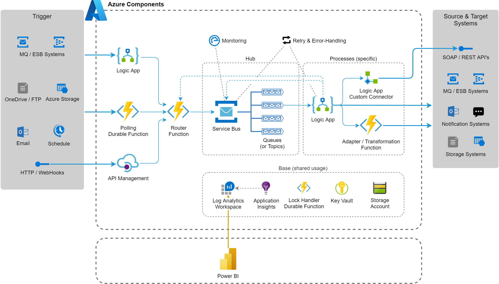

# Integration Pipeline
This blueprint contains a basis for integration scenarios where various data between shall be exchanged and transformed between systems in a robust and asynchronous way. It bases on central Service Bus deployment which orchestrates the processes by delivering messages in dedicated queues. These queues may be consumed by Logic Apps and/or Functions via standard connectors and further processed.

## Architecture

### Key Concepts
* Integration processes are split up into steps which can be completely re-executed in case of failures. Each of those steps has its queue in the Service Bus and many processes may end with handing over the message to the next queue.
* Non-processable events/messages end up in the dead letter queues of the Service Bus. This should be observed and handled accordingly
* Messages are processed sequentially (FIFO, all with the same priority). This concept needs to be specifically examined. In many cases the consuming processes runs fast (i.e. scale automatically) and no jams have to be expected (i.e. no need for prioritisations). In other situations you may consider (see [Priority Queue pattern](https://docs.microsoft.com/en-us/azure/architecture/patterns/priority-queue)):
  * Priority in metadata: Use a topic/subscription and apply filtering on the consumer
  * Separate queues for low/high priority messages: Implement an according routing logic
* A common pattern for complex integration processes (involving multiple Logic Apps) is to use Storage Account blobs to temporarily store the data object and pass its identification as a message parameter from one step to another

### Integration Patterns
1. Event-based: A connected bus system (on Azure: Event Grid, Event Hub, Storage Queue, other Service Bus) dispatches a trigger information. All data to be exchanged (payload) is then loaded from a source system as an early step in the process.
1. Message-based: Same as above, but the data to be exchanged (payload) is already included in the trigger information. Therefore the [maximal message size supported by the Service Bus](https://docs.microsoft.com/en-us/azure/service-bus-messaging/service-bus-quotas) has to be considered.
1. Request-based: External system calls an API (typically provided by a Function)
1. Schedule-based: Starting in preconfigured time intervals (trigger on Logic App or Function)

## Implementation Notes
### Logic Apps
Because of the no/low-code style, this is easily understandable and can be adjusted in an agile way. They further automatically provide retry-functionality and a full logging of all executions.

As Logic Apps are a cloud native service, they can be executed only in the cloud and are thus also defined and maintained manually in the Azure Portal. To provide a consistent source management and allow the (re-)deployment to (new) environments, following guidelines are recommended:
* Install the [Visual Studio Logic Apps Extension](https://marketplace.visualstudio.com/items?itemName=VinaySinghMSFT.AzureLogicAppsToolsForVS2019)
* You may (optionally) work completely within Visual Studio for workflow-definition, -execution and analysis. Consider this [MSDN manual](https://docs.microsoft.com/en-us/azure/logic-apps/manage-logic-apps-with-visual-studio).
* Whenever a stable state of a Logic App definition is achieved, the ARM definition is downloaded and saved to a `LogicApps` folder within the deployment project (overwrite existing definition)
* To prevent unexpected overrides by CD deployments, the deployment of Logic Apps is deactivated with ARM template parameter (name `deployLogicApps`) by default. For deployments to new environments or to reset unwanted modifications you can just enable this parameter.

References:
* [MSDN Connectors for Azure Logic Apps](https://docs.microsoft.com/en-us/azure/connectors/apis-list)
* [MSDN Batch processing of messages](https://docs.microsoft.com/en-us/azure/logic-apps/logic-apps-batch-process-send-receive-messages)
* [MSDN Large message handling (chunking)](https://docs.microsoft.com/en-us/azure/logic-apps/logic-apps-handle-large-messages)
* [MSDN Data conversion and transformation functions](https://docs.microsoft.com/en-us/azure/logic-apps/logic-apps-perform-data-operations)
* MSDN Custom Connector Reference for [REST API's (Swagger / Open API based)](https://docs.microsoft.com/en-us/connectors/custom-connectors/define-openapi-definition) & [SOAP API's (WSDL based)](https://docs.microsoft.com/en-us/connectors/custom-connectors/create-register-logic-apps-soap-connector)

### Service Bus
The recommended pattern to consume messages is peek-lock and manual completion / abandoning when the process is completed. To handle the potential problem of lock expirations you may consider [this solution](../../Snippets/csharp/service-bus-lock-handler).

References:
* [MSDN Service Bus quotas](https://docs.microsoft.com/en-us/azure/service-bus-messaging/service-bus-quotas)
* [MSDN Service Bus metrics & alerting](https://docs.microsoft.com/en-us/azure/service-bus-messaging/service-bus-metrics-azure-monitor)

### Functions
There is often the need to provide mappings or routing definitions in a configurable way. You may consider [this solution](../../Snippets/csharp/mapping-configuration).

## Deployment

