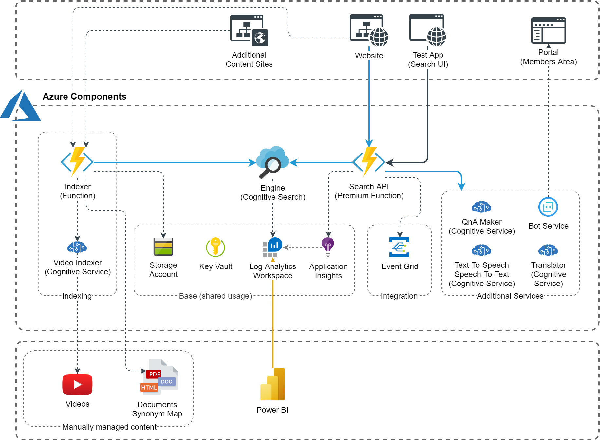

# Search Engine
This blueprint contains the base resources to create a central, independent search engine that delivers results from multiple data sources and enriches them with intelligent suggestions.

## Architecture

## Implementation Notes
### Test App (Search UI)
As basis you may use the [Cognitive Search Question Answering Solution Accelerator](https://github.com/Azure-Samples/search-qna-maker-accelerator) which includes a simple UI (React application).

## Deployment
