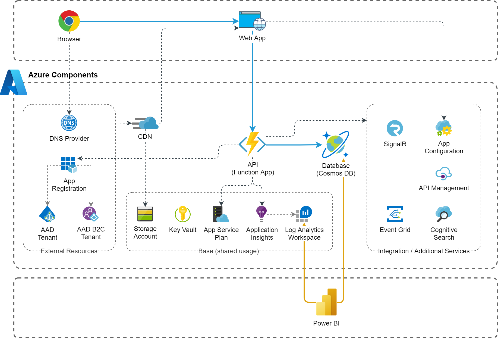

# SPA / API Application
This blueprint contains the basic resources for UI applications provided for customers or employees. It consists of a Single-page application (framework agnostic) statically hosted in a Storage Account and provided via a CDN which enables the configuration of a custom root or sub-domain as well as the definition of routing rules (e.g. HTTP to HTTPS, client-side routing). As a backend service it includes a Function App which provides HTTP-trigger based functions as simple REST API's and a Cosmos DB as database (can be easily exchanged with any other PaaS database service on Azure). Optionally, user authentication with Active Directory (either the regular AAD or AAD B2C) can be enabled for the Function.

## Architecture

## Implementation Notes
### CI / CD Pipelines
As a best practice, the single-page application as well as the Function App is built with a process independent from the deployment. With that, the same build artifact can be moved between stages. For current blueprint this includes some tricky functionality to be done in the deployment (release) process, including:
* Generation of API keys and injection of API configuration to SPA artifact
* CDN purging to make deployment available

For a CI/CD process based on Azure DevOps pipelines you may use [this snippet as a basis](../../Snippets/Pipelines/cascading-ci-cd-pipelines).

### Built-in Authentication in Function
App Services and Functions support [built-in authentication](https://docs.microsoft.com/en-us/azure/app-service/overview-authentication-authorization) (sometimes referred to as "Easy Auth") which can be used to generate tokens for the user (delegated access) or the application itself to access other API's. For development and local testing you may consider [this snippet](../../Snippets/csharp/function-built-in-auth-token-for-graph-api).

### Cosmos DB
The deployment generates a [Cosmos DB in serverless tier](https://docs.microsoft.com/en-us/azure/cosmos-db/serverless) which is a simple approach during development. For production deployment this should be examined as well as the configuration of backup / disaster recovery functionality.

## Deployment

