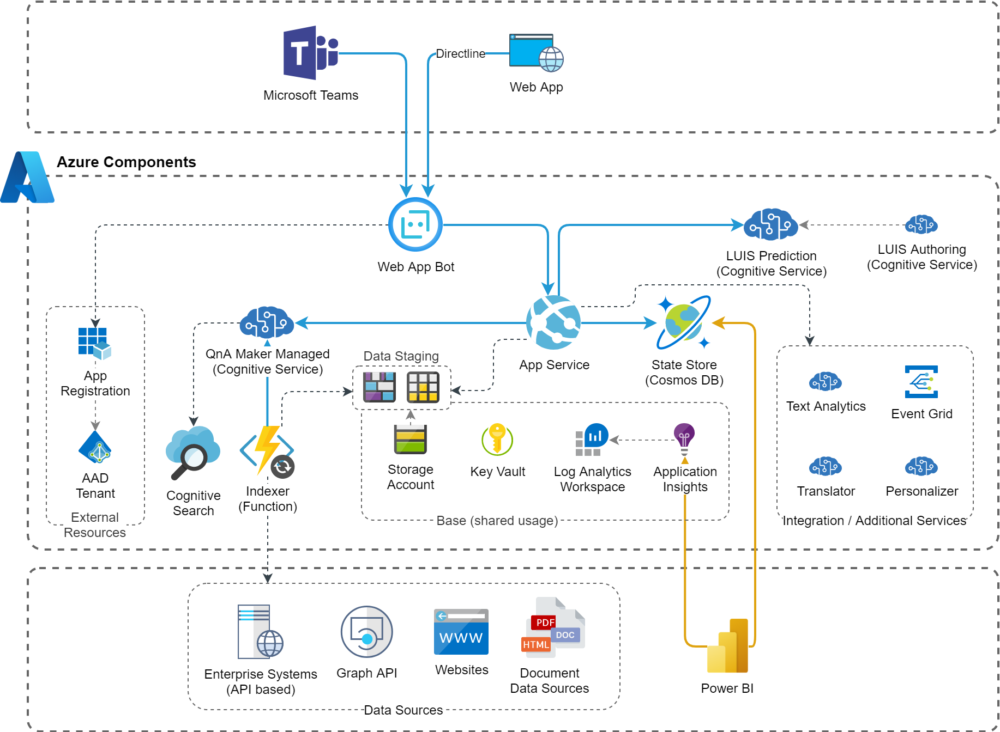

# Virtual Agent
This blueprint contains the resources to build a Virtual Agent which implements processes and helps the users with answers to questions. It consists of a Bot Framework based App Service with interacts with the Cognitive Services LUIS and QnA Maker, the latter being integrated with enterprise data sources.

Consider [this knowledge base article for an overview of Bot Framework components](../../Knowledge/Knowhow-AzureBotService-Overview).

## Architecture

## Implementation Notes
### Bot Framework Resources
* [MSDN Azure Bot Service Documentation](https://docs.microsoft.com/en-us/azure/bot-service/?view=azure-bot-service-4.0)
* [Github Bot Framework Resources](https://github.com/microsoft/botframework-sdk)

### Indexer Function
This [snippet provides a reference implementation](../../Snippets/csharp/qna-maker-data-ingestion-from-website) and shows the ingestion of data automatically extracted from a website.

## Deployment
Bot Framework solutions are normally built based on either the [Bot Framework Solution "Virtual Assistant" template](https://microsoft.github.io/botframework-solutions/virtual-assistant/tutorials/create-assistant/csharp/4-provision-your-azure-resources/) or with the [Bot Framework Composer](https://github.com/microsoft/BotFramework-Composer). Both include the Azure core resource definitions and an according deployment procedure as follows:
* [Bot Framework Solution deployment template](https://github.com/microsoft/botframework-solutions/tree/master/samples/csharp/assistants/virtual-assistant/VirtualAssistantSample/Deployment/Resources)
* [Bot Framework Composer deployment manual](https://docs.microsoft.com/en-us/composer/how-to-publish-bot)

This deployment script contains some additional components as defined in the architecture and needs to be merged or validated with the deployment result from the template used.

