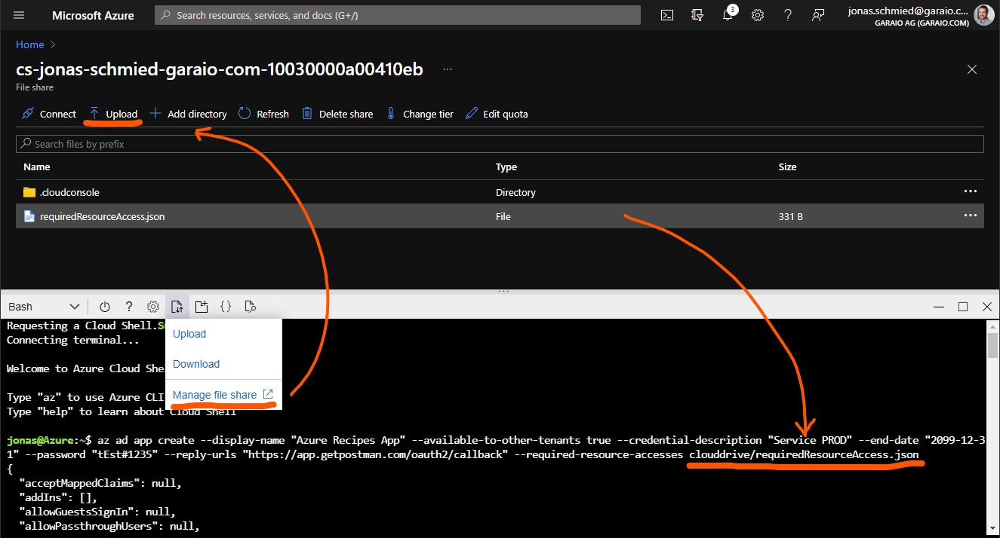

# Introduction
App Registrations are often used by resources such as Bot Service or App Services / Functions to grant access to API's or for user authentication. With a continuous deployment approach, there are certain challenges to ensure correct availability and continuity with the secret lifecycle.

# Recommended Approach for CD
Because the creation of App Registrations as well as the granting of permissions typically needs higher privileges than available in a deployment context (with Service Principal), App Registrations are typically not created like other Azure Resources as part of an application deployment (release) but pre-created manually.

The identifications of the prepared App Registrations are typically injected as pipeline variables during deployment, to be assigned to the according resources.

To simplify the initial deployment in a new/fresh environment, it is recommended to provide an executable script for the App Registrations.

# Expiration of Client Secrets
At around the beginning of 2021, Microsoft removed the option to create secrets with unlimited or long validity in the portal. In the portal (UI), it will only be possible to generate secrets with a maximum validity of 2 years. This results in critical problems for use in applications:
* If the expiry remains undetected, sudden operational disruptions result.
* A new release is required
* As of today, there is no possibility of notification of App Registrations with expiring Secrets.

Fortunately, the validity restriction does not apply if the secrets are created via the REST API (and thus also for CLI, PowerShell, C#, etc.).

## Create a new Secret (CLI / Cloud Shell)
When knowing the App Id (Client Id), this simple command can be executed directly in the Cloud Shell and it displays the generated secret in the result object.

```bash
az ad app credential reset --id 00000000-0000-0000-0000-000000000000 --append --credential-description "Service PROD" --end-date "2099-12-31"
```

## Create the App Registration along with a Secret (CLI / Cloud Shell)
It is currently only possible to generate a secret with a pre-defined value (password) with a single line of code. So, when removing the parameter `password`, no secret will be created at all.

```bash
az ad app create --display-name "Azure Recipes App" --available-to-other-tenants true --credential-description "Service PROD" --end-date "2099-12-31" --password "tEst#1235" --reply-urls "https://app.getpostman.com/oauth2/callback" --required-resource-accesses requiredResourceAccess.json
```

With [`requiredResourceAccess.json`](./requiredResourceAccess.json) as separate file in the same folder:
```json
[{
	"resourceAppId": "00000003-0000-0000-c000-000000000000",
	"resourceAccess": [
		{
			"id": "e1fe6dd8-ba31-4d61-89e7-88639da4683d",
			"type": "Scope"
		},
		{
			"id": "7ab1d382-f21e-4acd-a863-ba3e13f7da61",
			"type": "Role"
		},
		{
			"id": "332a536c-c7ef-4017-ab91-336970924f0d",
			"type": "Role"
		}
	]
}]
```

## Create an App Registration from an existing Manifest
App Registrations provide it's resource definition in a `manifest.json` which can be downloaded and also edited directly in the Azure Portal. There is a [CLI for M365 which includes an interesting command to directly generate new App Registrations from a `manifest.json`](https://pnp.github.io/cli-microsoft365/cmd/aad/app/app-add/) template file.

## Tip: Create a full Bash script to setup App Registrations for an Application
This could look like this (see [`script.sh`](./script.sh)):

```bash
#!/bin/bash

az login --allow-no-subscriptions

appId=$(az ad app create --display-name "Azure Recipes App" --available-to-other-tenants true --reply-urls "https://app.getpostman.com/oauth2/callback" "https://function.azurewebsites.net/.auth/login/aad/callback"  --required-resource-accesses requiredResourceAccess.json --query appId -o tsv)

appSecret=$(az ad app credential reset --id $appId --append --credential-description "Service PROD" --end-date "2099-12-31" --query password -o tsv)

echo "--- Copy following values"

echo "TenantId=$(az account show --query "tenantId" -o tsv)"
echo "ClientId=$appId"
echo "ClientSecret=$appSecret"

echo "--- Press  [ENTER] to close"
read continue
```

## Tip: Work with Files in Cloud Shell (Azure Portal)
Provided Bash script references some definitions in a JSON file. If you don't have the Azure CLI installed on your machine or by any other reason just want to run that command in the Cloud Shell you can achieve that as follows:



# References
* [Microsoft Q&A Entry: Plans with the maximum expiration of client secrets](https://docs.microsoft.com/en-us/answers/questions/422538/future-plans-of-microsoft-with-the-maximum-expirat.html)
* [Azure CLI: Create App Registration](https://docs.microsoft.com/en-us/cli/azure/ad/app?view=azure-cli-latest#az_ad_app_create)
* [Azure CLI: Create App Secret](https://docs.microsoft.com/en-us/cli/azure/ad/app/credential?view=azure-cli-latest#az_ad_app_credential_reset)
* [MSDN Azure Active Directory App Manifest](https://docs.microsoft.com/en-us/azure/active-directory/develop/reference-app-manifest)
