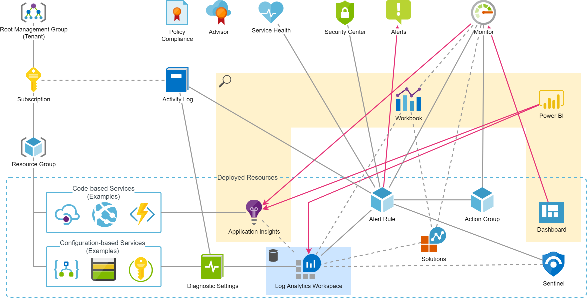

# Summary
This page contains an overview of services used and usable for monitoring and analytics, its relations and best practices to use them in PaaS/Serverless architectures.

# Overview
There are many services available which gather and analyse runtime data from resources and allow to gain insights. The documentation of those is overwhelming and it is sometimes difficult to know what to use and configure in which situation. Many of those services come from the time where IaaS has been the primary cloud architecture and are still very much focused on infrastrure aspects.

The picture above tries to provide a new view to all these services and mainly shows its relations. There are mainly following differentiations:
* Resources that are available globally and usually don't need an activation or much configuration. They usually do not generate costs (at least not in their basic setup, e.g. Defender for Cloud has a paid level too)
* Resources that have to be deployed and are thus placed in Resource Groups

# The Story of Everything
Azure Resources automatically generate runtime information which are stored inside the resource itself and analyzed by Monitor automatically. On almost all resources you find the section `Monitoring` and within that, the topic `Metrics` with the integration of the global Monitor service (and the most relevant metrics are typically made available on the `Overview` page). This has following aspects:
* This functionality does not generate costs
* The data ingested is available only for a limited amount of time
* Visualization of metrics can be pinned to `Dashboards` which therewith provide an almost realtime overview of one or multiple Resources

For more advanced usage you need to forward that using `Diagnostic Settings` to (multiple possible):
* Storage Account: Archiving (this is rare)
* Event Grid: Trigger e.g. Functions, Logic Apps, Stream Processing (specific use cases only)
* Log Analytics Workspace: A common log data store (typical use case)

Routing data to `Log Analytics Workspace` brings following benefits:
* Comprehensive queries feasible on data of multiple sources using the powerful KUSTO Query Language
* Simplified and standard data access for external analysis tools such as Power BI
* Data retention for up to 730 days (default is 30 days)

Additionally there are more advanced analysis possibilities by using `Workbooks`. These provide in-depth analysis of the data for a particular scope or topic. There are a bunch of standard `Workbooks` or you may create custom `Workbooks` by your own. Alternatively you can install `Solutions` from the Azure Marketplace which mainly bring in additional `Workbooks`.

Azure Resources which include or execute conventional code use an alternative solution: `Application Insights`. This service runs on top of an `Log Analytics Workspace` and extends its storage and querying functionality with very use- and powerful features:
* Predifined investigation views with pre-analyzed and filtered data for various operational aspectes such as failures, performance issues or availability
* If included in custom log information, `Application Insights` uses context identifications such as user or device and builds powerful views comparable to what e.g. Google Analytics offers
* The "Smart Detection" learns the reqular behaviour of the application and then detects anomalies which leads to alerts. This is a valuable "security net"
* It allows to configure Azure DevOps or Github to conveniently escalate and link work items to detected bugs (including all relevant debug data)
* If configured on .NET based App Service Resources (including Functions) it automatically performs a [profiling of the code](https://docs.microsoft.com/en-us/azure/azure-monitor/app/profiler-overview) and can generate [Debugger Snapshots](https://docs.microsoft.com/en-us/azure/azure-monitor/app/snapshot-debugger) on exceptions

The data gathered in `Application Insights` can be forwared to another `Log Analytics Workspace` using the `Diagnostic Settings` like configured on other Resources. Alternatively there it is now possible to deploy ["Workspace-based Application Insights"](https://docs.microsoft.com/en-us/azure/azure-monitor/app/create-workspace-resource) (Preview) - this enables having a single log data container for all log data of an application.

`Application Insights` may be integrated by almost any Software running anywhere. Besides applications in Virtual Machines or Containers this also includes e.g. Single Page Applications running in Browsers. With such an approach it is possible to create a central place for any insights from an application.

# Best Practices

## Log Analytics Workspace
* Link all relevant Resources for an application. There are various samples in this repository for according deployment (e.g. [Blueprints -> Serverless Base Resources -> KeyVault](../../Blueprints/serverless-base-resources))
* Use the "pay per use" model (except if other requirements apply). Configure Data Retention according to requirements.
* Store KQL queries for typical use cases

## Application Insights
* Always link `Application Insights` wherever possible. Share instance of `Application Insights` for components of same application or - for bigger architectures - isolated part of the application
* Use the new `Workspace-based Application Insights`. This is referenced in various snippets of this repository, e.g. [Blueprints -> Serverless Base Resources](../../Blueprints/serverless-base-resources)
* Prevent logging of sensitive information in code
* For .NET applications: Activate profiling and generate of Debugger Snapshots in deployment. Example [Function (properties in App Settings)](../../Snippets/ARM/function-api-management)
* For .NET applications: Setup and integrate `TelemetryClient` and track events with context information. Documentation for Azure Functions: https://docs.microsoft.com/en-us/azure/azure-functions/functions-monitoring?tabs=cmd#log-custom-telemetry-in-c-functions

## Activity Log
* Link to `Log Analytics Workspace`: [Snippet for ARM-based deployment](../../Snippets/ARM/activity-log-link-log-analytics-workspace)

## Alerts
### Monitor the specified Service Level
Analyze the given Service Level Agreement or promote the definition of according goals. For each relevant technical aspects define:
* Service Level Objective (SLO): What is the Goal? E.g. average response time of API calls below 2 seconds. 80% of all calls per hour below 1 second.
* Service Level Indicator (SLI): How can the aspect be measured technically? E.g. measure call duration and calculate average by a bin of 5 minutes

### Typical Monitoring Topics
Following list may help to identify critical aspects of an application for monitoring with `Alerts`.

<!-- Note: Edit tables with https://www.tablesgenerator.com/markdown_tables -->

| Resource | Aspect | Purpose | Examples / References |
|----------|--------|---------|-----------------------|
| Function | Duration | If running in consumption plan, the duration is limited to 5 minutes (default) and can be extended to maximally 10 minutes. An alert on durations of more than e.g. 80% can help to detect issues early and thus avoids unhandled timeout failures in production. | - |
| App Service | HTTP 500 | Unhandled exception leads to HTTP results on HTTP-triggered Functions or Web Apps. This is okay on pre-production systems but should be analyzed for prevention of the failure or appropriate error handling | - |
| App Service | Error-Rate | This may indicate systematic problems (e.g. configuration failures) typically after a deployment | - |
| App Service | CPU / Memory / Disk Usage | For Functions on a dedicated App Service Plan or Web Apps without configured auto-scaling this should be monitor to prevent overload situations | - |
| Resource Group | User Activities | Especially for productive environments it may be valuable to get notified of any manual changes (e.g. to make sure they are properly reflected in documentation or deployment scripts) | [Snippet for ARM-based deployment](../../Snippets/ARM/alert-rule-tampering) |
| Cognitive Search | Index Size | Depending on the used plan, this is very limited and may cause problems in production | - |
| Data Factory | Pipeline Executions | Inform about automatically triggered but failed executions (e.g. of integration or backup jobs) | [Snippet for KQL Query](../../Snippets/KQL/DataFactoryPipelineExecutions.txt) |
| Logic App | Executions | Inform about automatically triggered but failed executions (e.g. of integration or backup jobs) | - |
