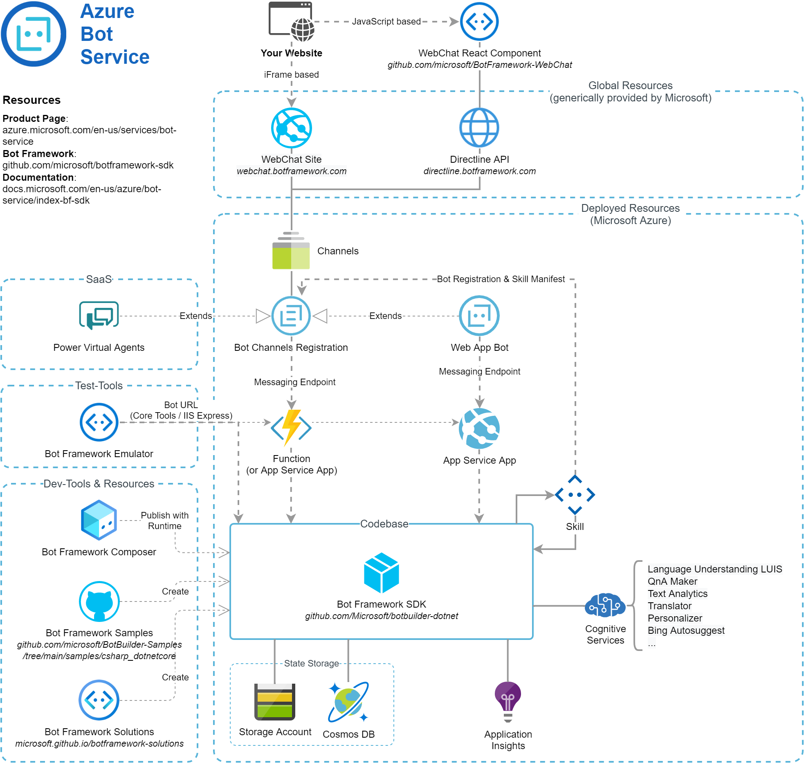

# Summary
This page contains an infographic (or schematic architecture) displaying the relationship of the various components and resources to build and run Azure Bot Service implementations. It includes Power Virtual Agent and Bot Framework tools such as the Composer or Emulator as they all rely on the Azure Bot Service.

# Overview
In the context of Microsoft Bot Framework or Bot Service, there is a growing set of tools, templates and services. This may be confusing especially for beginners. When working with these components, one soon recognizes common patterns which come from the fact that all Microsoft Bot offerings base on the same Bot infrastructure (the Azure Bot Service).

So what is the `Azure Bot Service`? It is not one particular Azure resource as other Azure services are. In fact, it bases on a globally available service which is sort of a gateway. Your bot application is registered and linked with this service (for custom bot applications by deploying the Azure Resource `Bot Channels Registration` or the more specific `Web App Bot`) which generates unique identifications for your bot. These identifications you can be passed to the global API (called `Directline`) or the according Chat UI Service - these identifications are then resolved and the requests (i.e. input from the user) is then forwarded to your specific bot application. The `Azure Bot Service` simply is this global infrastructure.

There are some approaches to run bot applications created with the Microsoft Bot Framework on different environments, but these are not realy "straight-forward". It is clearly meant to rely on the `Azure Bot Service` as runtime environment. Doing that it is not possible to fully control the runtime of the bot - despite you may deploy all your Azure Resources in e.g. the Region 'Switzerland North', the conversations with your bot may be routed over the whole world as the `Azure Bot Service` with its `Directline API` is a global service (in my personal experience you mostly get traffic from some principal regions such as 'West Europe', 'East US' and 'West US'). For advanced use cases, there is the `Direct Line App Service Extension` which should provide a bit more control to this behavior.

# References
* [Bot Framework Product Site](https://dev.botframework.com)
* [Bot Framework SDK (Github)](https://github.com/microsoft/botframework-sdk)
