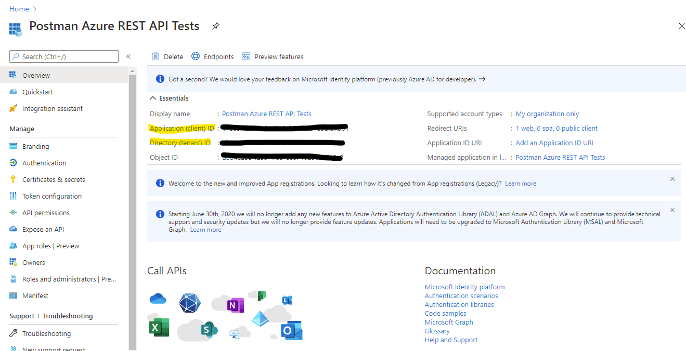
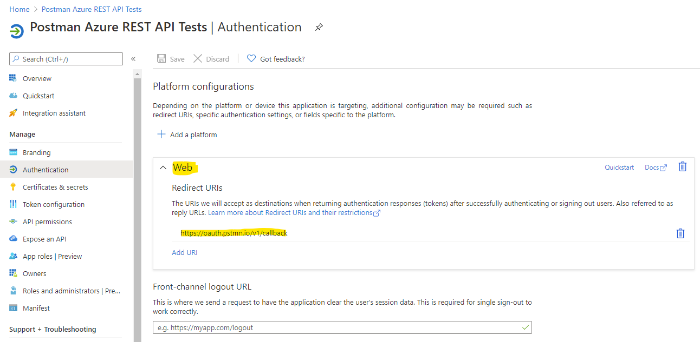
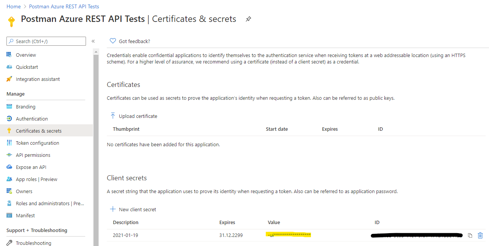
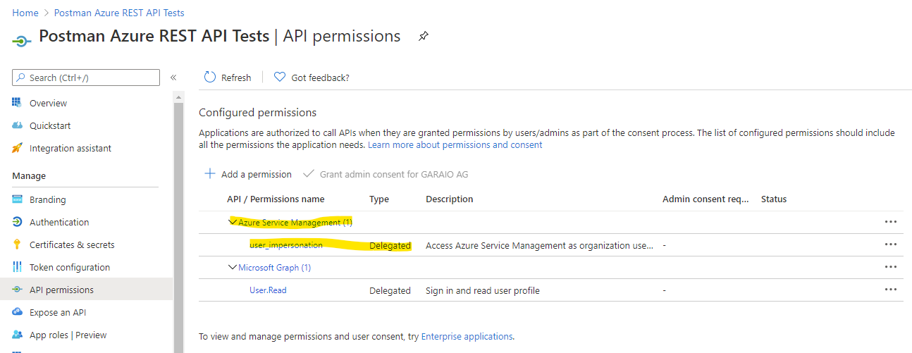
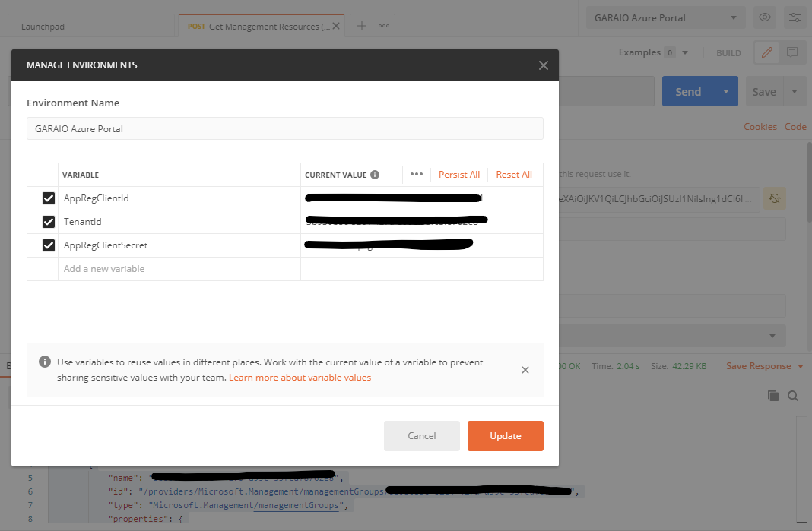
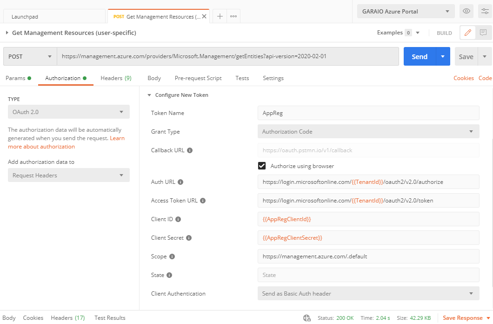
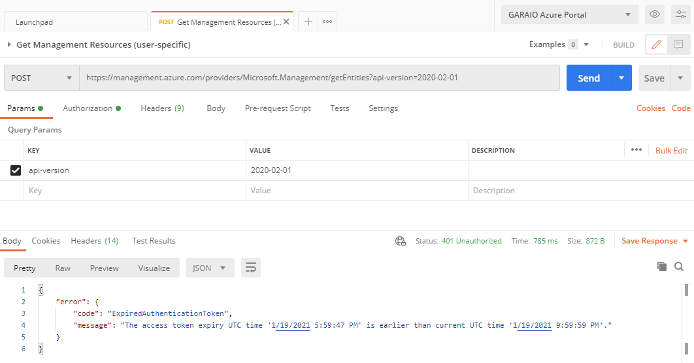
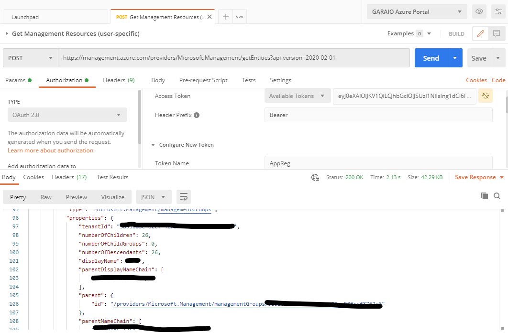

# Introduction
For almost every resource type as well as for the central Azure Resource Manager there is a [comprehensive REST API provided, which is also well documented](https://docs.microsoft.com/en-us/rest/api/azure/). However, the documentation and most of other internet resources just demonstrate how to authenticate a service principal for application access. This requires you to assign according permissions to resources (RBAC), which is not always wanted or even possible. For API calls with Postman you maybe want a delegated access based on your personal account.

# Manual
## App Registration
To get an authentication token for your account, you need to have an App Registration in the Azure Active Directory. This information shows up when you ask for an authentication the first time (grant access to application dialog).

You basically just have to define and specify:
* Web Platform with Redirect URI `https://oauth.pstmn.io/v1/callback` (implicit grant settings are not required)
* Client Secret (note it somewhere for later use, along with the `Application (client) ID` and `Directory (tenant) ID` you find on the Overview page)
* API permission for the API `Azure Service Management` type delegated

## Postman
Chose any API Method for testing, e.g. [List Management Resources for the authenticated user](https://docs.microsoft.com/en-us/rest/api/resources/entities/list). Copy this URL into Postman and set the HTTP method accordingly.

Create and define following variables with values you gathered just before:
* `TenantId`
* `AppRegClientId`
* `AppRegClientSecret`

In the `Authorization` Tab apply the following settings:
* Set type to `OAuth 2.0` (keep the proposed values to add the authorization data to Request Headers with prefix 'Bearer')
* In 'Configure New Token' specify:
  * Token Name = whatever you want
  * Grant Type = `Authorization Code`
  * Callback URL = _set flag `Authorize using browser` (this is required to not specify your credentials in Postman and to support MFA which is nowadays activated almost everywhere_
  * Auth URL = `https://login.microsoftonline.com/{{TenantId}}/oauth2/v2.0/authorize`
  * Access Token URL = `https://login.microsoftonline.com/{{TenantId}}/oauth2/v2.0/token`
  * Client ID = `{{AppRegClientId}}`
  * Client Secret = `{{AppRegClientSecret}}`
  * Scope = `https://management.azure.com/.default`
  * State = _you may keep the default value_
  * Client Authentication = _keep the default `Send as Basic Auth header`_

You can now send the API request and whenever you encounter authentication errors, just execute `Get New Access Token` which opens a browser and lets you login. After successfull authentication the (refreshed) authentication token is automatically added to the request header.

