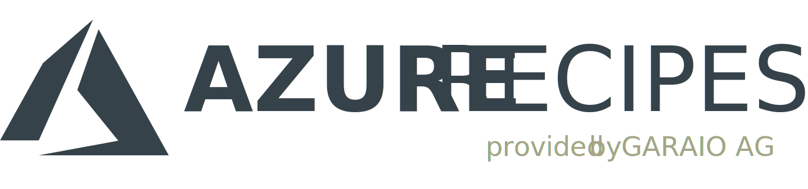

# Azure Recipes
This repository contains various guidances and artefacts collected during engineering of applications on Microsoft Azure. Most of them are based on PaaS or serverless services.

* [Contents](#contents)
  * [Blueprints](#blueprints)
  * [Snippets](#snippets)
  * [Templates](#templates)
  * [Knowledge](#knowledge)
* [Support](#support)
* [License](#license)

## Contents
The content is focused to the type of applications GARAIO AG typically develops as well as the tools and toolchain typically used for that. This includes mainly following tools:
* Azure DevOps (Code and Release Management, Pipelines)
* Visual Studio / Visual Studio Core (Engineering)
* Power BI (Analytics)

<!-- Note: Edit tables with https://www.tablesgenerator.com/markdown_tables -->

### Blueprints
Some quickstart templates for projects with standardized architectures.

| Architecture | Purpose | Description | Link |
|--------------|---------|-------------|------|
| Serverless | General applications | Base resources including Storage Account, Log Analytics Workspace, Application Insights and Key Vault | [Show](./Blueprints/serverless-base-resources) |

### Snippets
Directly reusable code artefacts for development, deployment or monitoring / analytics grouped by type of language or format.

| Type | Description                           | Link             |
|------|---------------------------------------|------------------|
| ARM  | [Azure Resource Manager templates](https://docs.microsoft.com/en-us/azure/templates/) for deployment definitions    | [Show](./Snippets/ARM/README.md) |
| CLI  | Azure Command Line Interface commands. This also includes queries based on [JMESPath](https://jmespath.org/) | [Show](./Snippets/CLI/README.md)  |
| csharp | Code snippets such as classes or methods for functionality e.g. in Functions. Class libraries are rather published via Nuget.  | [Show](./Snippets/csharp/README.md) |
| KQL  | [Kusto Query Language](https://docs.microsoft.com/en-us/azure/data-explorer/kusto/query/) snippets used for analytics in various services such as Application Insights, Log Analytics Workspace or Data Explorer | [Show](./Snippets/KQL/README.md)  |
| Pipelines  | Azure DevOps pipelines or pipeline tasks in either YAML or JSON format | [Show](./Snippets/Pipelines/README.md)  |
| PowerQuery | [PowerQuery M](https://docs.microsoft.com/en-us/powerquery-m/) or DAX artefacts used in Power BI (or e.g. Data Factory wrangling data flows)  | [Show](./Snippets/PowerQuery/README.md) |

### Templates
This contains document structures and contents for technical reviews and project-specific definition of guidelines or conventions.

| Type | Scope | Description | Link |
|------|-------|-------------|------|
| Convention | Project Setup, Consulting | How to structure and name application components as code artefacts and Azure resources | [Show](./Templates/Convention-ResourceStructuringAndNaming.md) |
| Convention | Project Setup, Consulting | How to tag Azure resources for maintainability | [Show](./Templates/Convention-ResourceTagging.md) |
| Structure | Cloud Strategy, Operations & Governance | Basic definition and framework for development and operation of IT applications on Azure, based on and adapted from the [Microsoft Cloud Adoption Framework](https://docs.microsoft.com/en-us/azure/cloud-adoption-framework/operating-model). | [Show](./Templates/Structure-CloudOperatingModel) |
| Miscellaneous | Cloud Migrations | Various templates for visualisation, planning and decision-making to support enterprise-level application migration (templates are mostly in German) | [Show](./Miscellaneous-CloudMigrationResources) |

### Knowledge
In that folder various "Knowhow", "Tips & Tricks" and "Best Practices" content is collected, e.g. regarding setup of Azure service configurations or selection of most appropriate Azure Service for specific requirements.

| Type | Scope | Description | Link |
|------|-------|-------------|------|
| Best Practices | Power BI | Tips for creating valuable Application Dashboards to empower the project/product team with deep knowledge | [Show](./Knowledge/BestPractices-PowerBI-ApplicationDashboards) |
| Best Practices | Azure Solutions | Overview of services used and usable for monitoring and analytics, its relations and best practices to use them in PaaS/Serverless architectures | [Show](./Knowledge/BestPractices-AzureSolutions-Monitoring) |
| Knowhow | Azure Bot Service | Infographic (or schematic architecture) displaying the relationship of the various components and resources to build and run Azure Bot Service implementations. Includes Power Virtual Agent and Bot Framework tools such as the Composer or Emulator. | [Show](./Knowledge/Knowhow-AzureBotService-Overview) |
| Tips & Tricks | Azure Management REST API | For almost every resource type as well as for the central Azure Resource Manager there is a [comprehensive REST API provided, which is also well documented](https://docs.microsoft.com/en-us/rest/api/azure/). However, the documentation and most of other internet resources just demonstrate how to authenticate a service principal for application access. This requires you to assign according permissions to resources (RBAC), which is not always wanted or even possible. For API calls with Postman you maybe want a delegated access based on your personal account. | [Show](./Knowledge/TipsAndTricks-ManagementApi-Postman) |

## Support
If you need help with some content or find a bug then you may [create an issue](https://github.com/garaio/AzureRecipes/issues). For further inquiries please use contact possibilities on the [official website](https://garaio.com).

## License

- **[MIT license](http://opensource.org/licenses/mit-license.php)**
- Copyright 2021 © <a href="https://garaio.com" target="_blank">GARAIO AG</a>
