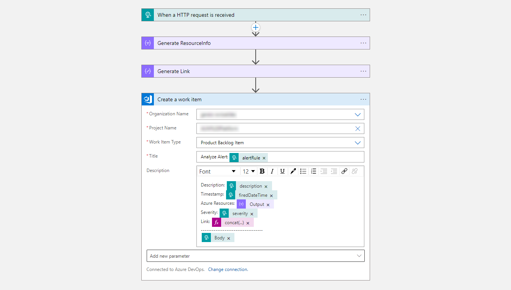
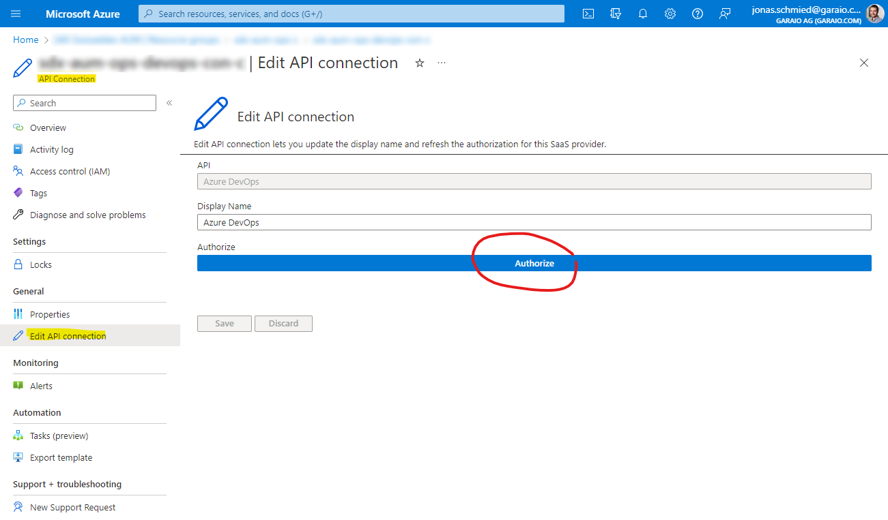

# Alerting Infrastructure on Application Level

This provides an implementation for the per-application setup (commonly used by all its modules and environments) according to the [Alerting Strategy Template](../../../Templates/Guideline-AlertingStrategy).

It contains an Action Group with a linked DevOps Handler/Connector (implemented as Logic App) and a Service Health Alert Rule (which has can be created on Subscription level only). The bicep definition is also intended to be extended with any custom Action Groups for custom use cases (e.g. notification of 3rd party providers).

# DevOps Handler

This snippet contains a module to be optionally deployed. It generates an Action Group that can be referenced in Alert Rules detecting technical issues (bugs). Therefore a task will be directly created in the connected Azure DevOps project using a Logic App as follows:



After successful deployment you need to initially authorize the connection with a user login directly in the Azure Portal:



> This reference implementation can be adjusted to different needs (e.g. more or other contents in the created ticket) or slightly refactored to integrate another task management or ticketing system.

# Integration / Deployment

Typically this integrated directly in the continous delivery (CD) pipeline as a common stage (before deploying modules to one or more environments). Sample:

```yaml
stages:
  - stage: deploy_cmn_monitor
    displayName: 'Deploy COMMON Monitoring'
    dependsOn: []
    jobs:
      - deployment: monitoring
        displayName: 'Monitoring Services'
        pool:
          vmImage: 'ubuntu-latest'
        environment: 'COMMON'
        variables:
          - group: Release - Common
          - name: deploymentFolderName
            value: 'Customer.Project.Deployment'
          - name: ciArtifactName
            value: 'services'
          - name: resourceNameSuffix
            value: 'c'
          - name: resourceLocation
            value: 'switzerlandnorth'
          - name: resourceGroupName
            value: '$(opsResourceNamePrefix)-${{ variables.resourceNameSuffix }}'
        strategy:
          runOnce:
            deploy:
              steps:
                - task: AzureCLI@2
                  displayName: 'Create Resource Group'
                  inputs:
                    azureSubscription: 'ARM Service Connection'
                    scriptType: bash
                    scriptLocation: inlineScript
                    inlineScript: |
                      az group create --location $(resourceLocation) --name $(resourceGroupName) --tags 'DeployedAt=$(currentDate)' 'DeployedBy=$(Build.RequestedFor)' 'DeployedFrom=$(System.TeamProject)'

                - task: AzureResourceManagerTemplateDeployment@3
                  displayName: 'Deploy ARM Template (ResourceGroup)'
                  inputs:
                    azureResourceManagerConnection: 'ARM Service Connection'
                    subscriptionId: '$(subscriptionId)'
                    resourceGroupName: '$(resourceGroupName)'
                    location: '$(resourceLocation)'
                    csmFile: '$(Pipeline.Workspace)/CI-Pipeline/$(ciArtifactName)/$(deploymentFolderName)/azuredeploy.app-ops.bicep'
                    overrideParameters: '-resourceNamePrefix "$(opsResourceNamePrefix)" -resourceNameSuffix "$(resourceNameSuffix)" -actionGrpOrgOpsIndicationsResId "$(actionGrpOrgOpsIndicationsResId)"'
                    deploymentMode: 'Incremental'
                    deploymentName: 'CUST-PROJ-AppOps-$(Build.BuildId)-$(Environment.Name)'

  - stage: deploy_test
    displayName: 'Deploy TEST Environment'
    dependsOn: deploy_cmn_monitor
    jobs:
      ...

  - stage: deploy_prod
    displayName: 'Deploy PROD Environment'
    dependsOn: deploy_test
    jobs:
      ...
```

[](https://portal.azure.com/#create/Microsoft.Template/uri/https%3A%2F%2Fraw.githubusercontent.com%2Fgaraio%2FAzureRecipes%2Fmaster%2FSnippets%2FARM%2Falerting-infra-application-level%2Fazuredeploy.app-ops.bicep)
