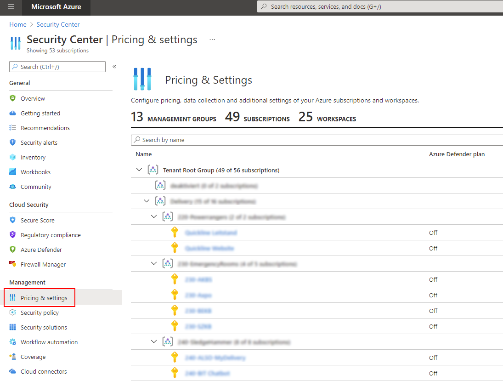

# Overview
Configure service plan (i.e. activation of Azure Defender), security contact & email notfications and continous export of alert, assessment and score data to a Log Analytics Workspace.

You can manually access these configurations in the portal by selecting the subscription in the Security Center settings view:

# Deployment

# Further Information
https://techcommunity.microsoft.com/t5/azure-security-center/managing-security-center-at-scale-using-arm-templates-and-azure/ba-p/327761