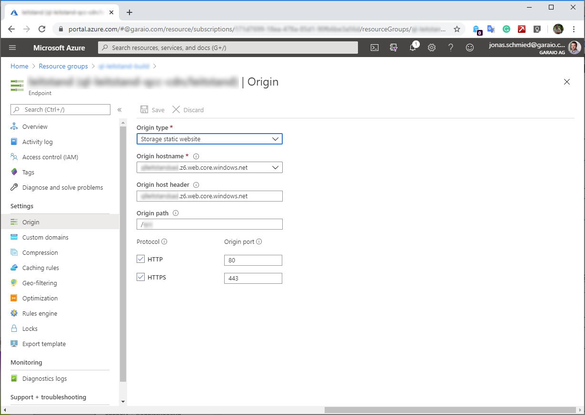
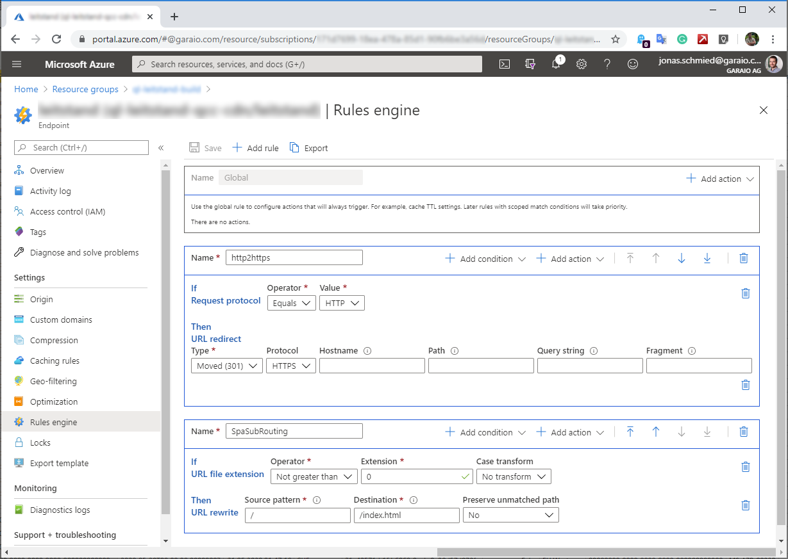

# Overview
If SPA is provisioned via Storage Account Blob (e.g. with Static Website feature) then it is higly recommended to setup a CDN for following purposes:
* Route HTTP to HTTPS
* Ignore client-side routing

Further the CDN is used for Custom Domain setup, SSL and additional performance improvement (and cost optimization for highly used applications).

A CDN setup consists of following resources:
* CDN Profile
  * CDN Endpoint (required per SPA application with independent access)
    * Origin targetting the SPA resources in the Storage Account
	* Rules (as explained above)

# Further Information
https://stackoverflow.com/questions/58914446/azure-cdn-microsoft-standard-rewrite-url-angular