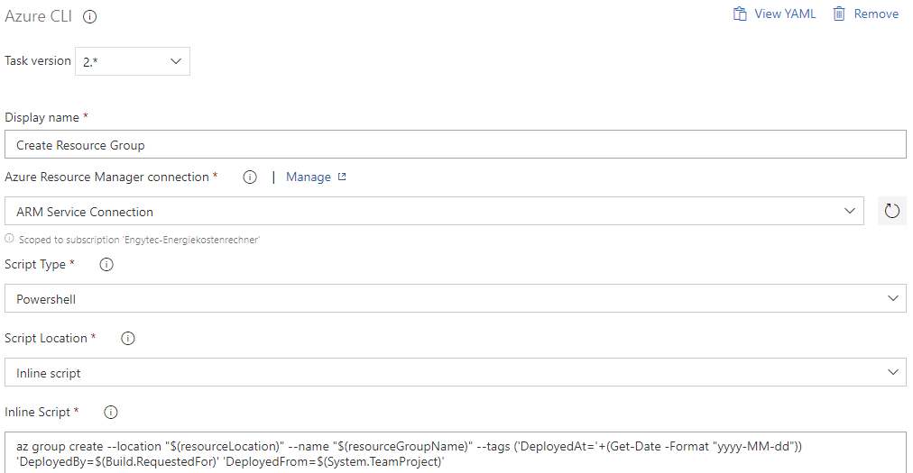

# Overview
Despite this task is simple, it may be tricky to inject some values calculated with PowerShell into the CLI command.
```yaml
- task: AzureCLI@2
  displayName: 'Create Resource Group'
  inputs:
    azureSubscription: 'ARM Service Connection'
    scriptType: ps
    scriptLocation: inlineScript
    inlineScript: 'az group create --location "$(resourceLocation)" --name "$(resourceGroupName)" --tags (''DeployedAt=''+(Get-Date -Format "yyyy-MM-dd")) ''DeployedBy=$(Build.RequestedForEmail)'' ''DeployedFrom=$(System.TeamProject)'''
```

It is also possible to use it in classic pipelines as follows:



# References
* [Tagging Convention Template](../../../Templates/Convention-ResourceTagging.md)
