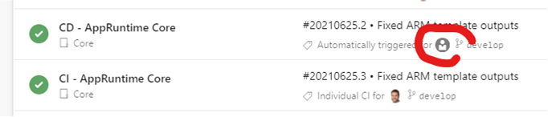
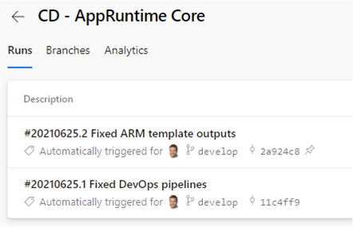

# Overview
Despite this task is simple, it may be tricky to inject some values calculated with PowerShell into the CLI command.
```yaml
- task: AzureCLI@2
  displayName: 'Create Resource Group'
  inputs:
    azureSubscription: 'ARM Service Connection'
    scriptType: ps
    scriptLocation: inlineScript
    inlineScript: 'az group create --location "$(resourceLocation)" --name "$(resourceGroupName)" --tags (''DeployedAt=''+(Get-Date -Format "yyyy-MM-dd")) ''DeployedBy=$(Build.RequestedForEmail)'' ''DeployedFrom=$(System.TeamProject)'''
```

It is also possible to use it in classic pipelines as follows:


# About User Information in DevOps Pipelines
This [MSDN documentation](https://docs.microsoft.com/en-us/azure/devops/pipelines/build/variables?view=azure-devops&tabs=yaml#identity_values) provides an overview of what user information is available in pipelines depending on the trigger. Generally, `Build.RequestedFor` (full name) or `Build.RequestedForEmail` (email) are most appropriate.

Unfortunately with `Build.RequestedForEmail` there is (currently) a bug in Azure DevOps so that this value is often and haphazardly not available (also documented [here](https://developercommunity.visualstudio.com/t/tfs-2017-buildrequestedforemail-variable-is-empty/1281511)). This is also visible in the portal, like:
1. Overview: User information is missing 
1. Detail view on the same pipeline: Same information is now correct 

Conclusion: Using `Build.RequestedForEmail` as tag value will often cause empty/null values in Azure, but `Build.RequestedFor` should always contain the correct user name (except when the pipeline is triggered by schedule).

# References
* [Tagging Convention Template](../../../Templates/Convention-ResourceTagging.md)
