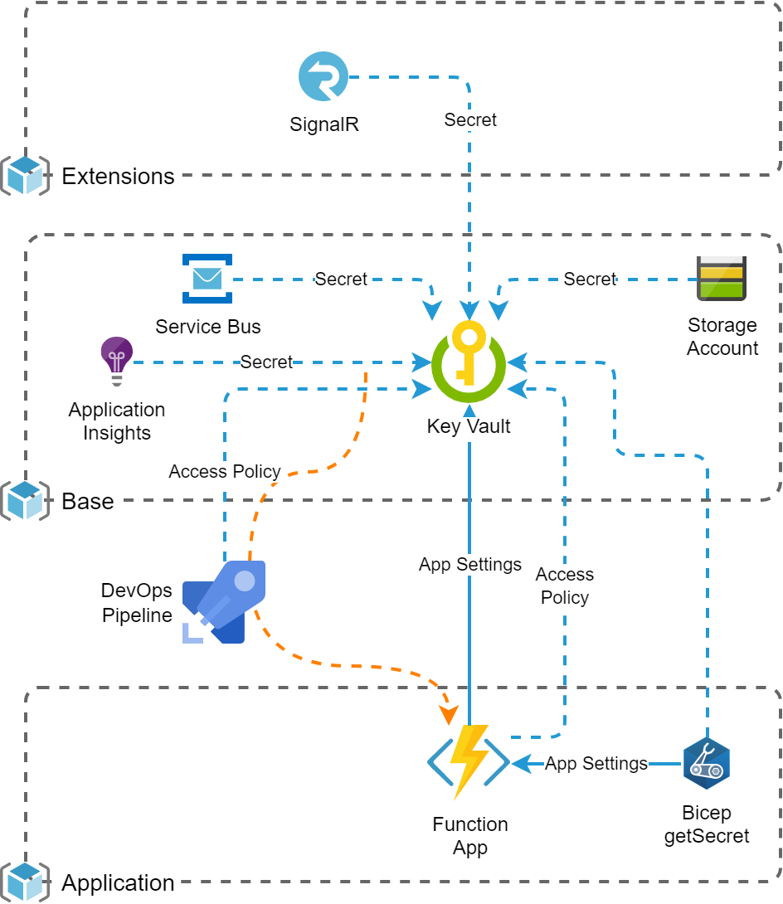

# Overview
When an application consists of multiple modules (i.e. with independent Resource Groups and deployments), the configuration of resources in other modules such as e.g. connection strings becomes a challenge. This snippet shows the possible strategies to resolve with minimal configuration complexity.

## Common Bad Practices
To resolve the challenge of passing configurations from other deployments, these patterns are sometimes implemented:
* The configurations are manually configured in variable groups. Means, module A is initially deployed, then its values are extracted from the resources and configured in a Variable Group so that module B can use them.
_Problems = Manual efforts, error-prone and there deployment dependencies which can hardly be controlled (e.g. module B not deployment before module A is initially set up)._
* Configurations are exchanged via ARM deployment outputs with a subsequent task that propagates these outputs to variables.
_Problems = Security risks (publishing secrets in outputs is not safe and also causes warnings in Bicep linter) and it can be done stable only in the same DevOps pipeline (which is not a clean isolation of modules)._

## Sample Architecture
The possible use cases are shown with this sample architecture:


# Use Cases
## Allow Access Policies from multiple sources
With the default creation mode, the KeyVault overrides all existing Access Policies with a new array. The creation mode `recover` allows to keep all current definitions and implement an "upsert" like behaviour for deployments of Access Policies. But this mode fails for initial deployments. So we determine first if the KeyVault already exists.

[`templates.deploy-to-stage.yml`](./templates.deploy-to-stage.yml):
```yaml
- task: AzureCLI@2
  displayName: 'Evaluate variables for KeyVault deployment'
  inputs:
    azureSubscription: '${{ parameters.armServiceConnection }}'
    scriptType: bash
    scriptLocation: inlineScript
    inlineScript: |
      keyVaultCount=$(az keyvault list --query "[?name=='$(keyVaultName)'] | length(@)" --subscription $(subscriptionId))
      if [ $keyVaultCount -gt 0 ]; then
        echo "##vso[task.setvariable variable=keyVaultExists;]true"
      else
        echo "##vso[task.setvariable variable=keyVaultExists;]false"
      fi

- task: AzureResourceManagerTemplateDeployment@3
  displayName: 'Deploy ARM Template (ResourceGroup)'
  inputs:
    azureResourceManagerConnection: '${{ parameters.armServiceConnection }}'
    ...
    csmFile: '$(Pipeline.Workspace)/CI-Pipeline/$(ciArtifactName)/azuredeploy.base.json'
    overrideParameters: '-resourceNamePrefix "$(baseResourceNamePrefix)" -resourceNameSuffix "${{ parameters.resNameEnv }}" -useExistingKeyVault $(keyVaultExists) -servicePrincipalId "$(armServicePrincipalId)"'
```

[`azuredeploy.base.bicep`](./azuredeploy.base.bicep):
```ts
resource keyVaultRes 'Microsoft.KeyVault/vaults@2021-10-01' = {
  name: keyVaultName
  location: resourceLocation
  properties: {
    sku: {
      family: 'A'
      name: 'standard'
    }
    tenantId: subscription().tenantId
    enabledForTemplateDeployment: true
    createMode: useExistingKeyVault ? 'recover' : 'default'
    accessPolicies: []
  }
}
```

## Add secrets to an external Key Vault
Deployments to resources in another Resource Group are most easily made with Bicep modules (nested templates):

[`modules.keyVaultSecret.bicep`](./modules.keyVaultSecret.bicep):
```ts
param keyVaultName string
param secretName string
@secure()
param secretValue string

resource keyVaultRes 'Microsoft.KeyVault/vaults@2021-10-01' existing = {
  name: keyVaultName
}

resource keyVaultSecretRes 'Microsoft.KeyVault/vaults/secrets@2021-10-01' = {
  parent: keyVaultRes
  name: secretName
  properties: {
    value: secretValue
  }
}
```

[`azuredeploy.extension.bicep`](./azuredeploy.extension.bicep):
```ts
module keyVaultSecretSignalRConnectionStringRes './modules.keyVaultSecret.bicep' = if (!empty(keyVaultName) && !empty(keyVaultResourceGroupName)) {
  name: keyVaultSecretSignalRConnectionString
  scope: resourceGroup(keyVaultResourceGroupName)
  params: {
    keyVaultName: keyVaultName
    secretName: keyVaultSecretSignalRConnectionString
    secretValue: listKeys(signalRServiceRes.id, '2021-10-01').primaryConnectionString
  }
}
```

## Reference secrets from external Key Vault
The common [reference syntax for App Services and Function Apps](https://docs.microsoft.com/en-us/azure/app-service/app-service-key-vault-references) does not require the Key Vault being deployed to the same Resource Group or within the same deployment definition.

[`modules.funcAppSettings.bicep`](./modules.funcAppSettings.bicep):
```ts
resource serviceFuncAppSettingsRes 'Microsoft.Web/sites/config@2021-03-01' = {
  parent: serviceFuncRes
  name: 'appsettings'
  properties: {
    ...
    StorageConnectionString: '@Microsoft.KeyVault(VaultName=${keyVaultName};SecretName=${keyVaultSecretStorageAccountConnectionString})'
    ...
  }
}
```

Deploying the Access Policy for the MSI ([`azuredeploy.application.bicep`](./azuredeploy.application.bicep)):
```ts
module keyVaultAccessPolicyRes './modules.keyVaultAccessPolicy.bicep' = if (!empty(keyVaultName) && !empty(keyVaultResourceGroupName)) {
  name: 'keyvault-accesspolicy-service'
  scope: resourceGroup(keyVaultResourceGroupName)
  params: {
    keyVaultName: keyVaultName
    principalId: reference(serviceFuncRes.id, '2021-03-01', 'Full').identity.principalId
  }
}
```

[`modules.keyVaultAccessPolicy.bicep`](./modules.keyVaultAccessPolicy.bicep):
```ts
param keyVaultName string
param principalId string
param appPermissions object = {
  keys: [
    'get'
  ]
  secrets: [
    'get'
  ]
}

resource keyVaultRes 'Microsoft.KeyVault/vaults@2021-10-01' existing = {
  name: keyVaultName
}

resource keyVaultAccessPoliciesRes 'Microsoft.KeyVault/vaults/accessPolicies@2021-10-01' = {
  parent: keyVaultRes
  name: 'add'
  properties: {
    accessPolicies: [
      {
        tenantId: subscription().tenantId
        objectId: principalId
        permissions: appPermissions
      }
    ]
  }
}
```

## Read secrets in ARM/Bicep
This is well documented in [MSDN Bicep/ARM documentation](https://docs.microsoft.com/en-us/azure/azure-resource-manager/bicep/key-vault-parameter?tabs=azure-cli#use-getsecret-function). Valuable to know:
* It can be used solely with modules (nested templates). This can become a challenge for defining a cleanly structured resource definition file and in some cases, it causes too much parameter definition & value copying stuff.
* It conflicts with the principle of separation of concerns: The module B needs to know the whole architecture and hardly depends on definitions in module A (KeyVault, name of secrets). Ideally, resource-definitions are encapsulated and all external stuff comes in via parameters. And the pipelines orchestrate all references. When defining active Key Vault references in e.g. application settings, this is rather acceptable (the connection is "live" and takes most current values) than with deployment-time only dependencies.

[`azuredeploy.application.bicep`](./azuredeploy.application.bicep)
```ts
resource keyVaultRes 'Microsoft.KeyVault/vaults@2021-10-01' existing = if (!empty(keyVaultName) && !empty(keyVaultResourceGroupName)) {
  name: keyVaultName
  scope: resourceGroup(keyVaultResourceGroupName)
}

module serviceFuncAppSettingsRes './modules.funcAppSettings.bicep' = if (!empty(keyVaultName) && !empty(keyVaultResourceGroupName)) {
  name: 'func-appsettings'
  params: {
    keyVaultName: keyVaultName
    serviceFuncName: serviceFuncName
    storageAccountConnectionString: keyVaultRes.getSecret(keyVaultSecretStorageAccountConnectionString)
    ...
  }
  dependsOn: [
    keyVaultAccessPolicyRes
  ]
}
```

## Read secrets in pipeline
Gather AAD identifier of Service Principal ([`templates.deploy-to-stage.yml`](./templates.deploy-to-stage.yml)):
```yaml
- task: AzureCLI@2
  displayName: 'Evaluate variables for KeyVault deployment'
  inputs:
    azureSubscription: '${{ parameters.armServiceConnection }}'
    scriptType: bash
    scriptLocation: inlineScript
    addSpnToEnvironment: true # Important: This makes the built-in variable `servicePrincipalId` available
    inlineScript: |
      svcConObjectId=$(az ad sp show --id $servicePrincipalId --query id -o tsv)
      echo "##vso[task.setvariable variable=armServicePrincipalId;]$svcConObjectId"

- task: AzureResourceManagerTemplateDeployment@3
  displayName: 'Deploy ARM Template (ResourceGroup)'
  inputs:
    azureResourceManagerConnection: '${{ parameters.armServiceConnection }}'
    ...
    csmFile: '$(Pipeline.Workspace)/CI-Pipeline/$(ciArtifactName)/azuredeploy.base.json'
    overrideParameters: '-resourceNamePrefix "$(baseResourceNamePrefix)" -resourceNameSuffix "${{ parameters.resNameEnv }}" -useExistingKeyVault $(keyVaultExists) -servicePrincipalId "$(armServicePrincipalId)"'
```

Deploy Access Policy ([`azuredeploy.base.bicep`](./azuredeploy.base.bicep)):
```ts
resource keyVaultAccessPoliciesRes 'Microsoft.KeyVault/vaults/accessPolicies@2019-09-01' = {
  parent: keyVaultRes
  name: 'add'
  properties: {
    accessPolicies: union(empty(servicePrincipalId) ? [] : [ 
      {
        tenantId: subscription().tenantId
        objectId: servicePrincipalId
        permissions: keyVaultAppPermissions
      } 
    ], [
    ])
  }
}
```

Read all or selected secrets and provide them as variables ([`templates.deploy-to-stage.yml`](./templates.deploy-to-stage.yml)):
```yaml
# Note: This step bases on the Access Policy created for thepipeline's Service Principal in first deployment job
- task: AzureKeyVault@1
  displayName: 'Gather KeyVault values'
  inputs:
    azureSubscription: '${{ parameters.armServiceConnection }}'
    KeyVaultName: '$(keyVaultName)'
    SecretsFilter: 'appInsightsInstrumentationKey' # Comma-separated list of secrets -> The're made available as pipeline variables with same name
    RunAsPreJob: false # No impact: https://docs.microsoft.com/en-us/azure/devops/pipelines/tasks/deploy/azure-key-vault?view=azure-devops#arguments
```

# Further Notes
* Consider the use of Key Vault with RBAC mode instead of having Access Policies. So you don't need to gather the Service Principal and deploy a policy for it (but of course it may have other impacts which may cause other complexity).
