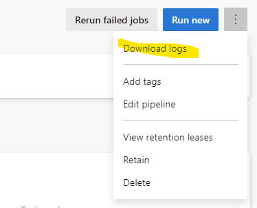

# Introduction
Reuse common deployment steps in a CD pipeline for multiple stages by using a template.

# Important to know
The pipeline is built on instantiation (i.e. when startet to run) by flattening all template references to one single pipeline file. This can be checked by downloading logs on a particular run, which can be very helpful for debugging:

These are common pitfalls:
* Specifying ARM Service Connection on tasks based on variables **does only work if the variable is declared on root level**, means: it does not work if the variable is set (internally or loaded from a variable group) on the level of a stage or job
* Variables cannot be defined in templates on root level (except when only variables without any stages, jobs or tasks are defined)
* Use the referencing `${{ variables.name }}` whenever the value can be statically resolved when starting the pipeline and do not use the form `$[ variables.name ]` in templates

# Resources
* [CD Pipeline](./azure-pipelines.cd.yml)
* [Template](./templates.deploy-to-stage.yml)

# References
* [MSDN Template types & usage](https://docs.microsoft.com/en-us/azure/devops/pipelines/process/templates?view=azure-devops)