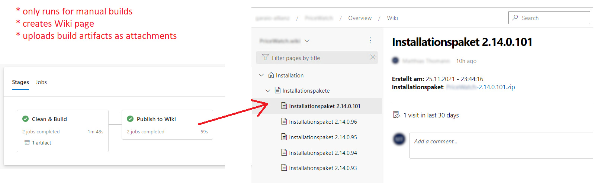

# Introduction
Sometimes built artifacts cannot be deployed directly with DevOps pipelines and (or additionally) needs to be published somewhere for handover. An possible solution is to use the integrated Wiki for this.



Excerpt from [`azure-pipelines.ci.yml`](./azure-pipelines.ci.yml):

```yaml
- task: PowerShell@2
  displayName: 'Upload Artifacts to Wiki'
  inputs:
    targetType: inline
    script: |
      $uri = ('https://dev.azure.com/{0}/{1}/_apis/wiki/wikis/{2}/attachments?name={3}&api-version=6.0' -f '$(devOpsOrgName)', '$(devOpsProjName)', '$(devOpsWikiName)', '$(devOpsWikiFileName).zip')
      $directory = "$(Build.ArtifactStagingDirectory)/$(artifactName)"
      $fileName = "$directory/$(devOpsWikiFileName)"
      Write-Host "Uploading attachment in organization '$(devOpsOrgName)' in project '$(devOpsProjName)' in wiki space '$(devOpsWikiName)' at path '$(devOpsWikiPath)'..."
      Write-Host "PUT URL: $uri"
      Write-Host "File Path: $fileName.zip"
      $Header = @{
          'Authorization' = 'Basic ' + [Convert]::ToBase64String([Text.Encoding]::ASCII.GetBytes(":$(PersonalAccessToken)")) 
      }
      # Compress files to zip
      Compress-Archive -Path "$fileName.msi" -DestinationPath "$fileName.zip"
      $base64File = [convert]::ToBase64String((Get-Content -path "$fileName.zip" -Encoding byte -ReadCount 0))
      $params = @{
          'Uri'         = $uri
          'Headers'     = $Header
          'Method'      = 'Put'
          'ContentType' = 'application/octet-stream'
          'body'        = $base64File
      }
      Invoke-RestMethod @params
      Write-Host "Attachment uploaded successfully."
- task: PowerShell@2
  displayName: 'Create Wiki Page'
  inputs:
    targetType: inline
    script: |
      $uri = ('https://dev.azure.com/{0}/{1}/_apis/wiki/wikis/{2}/pages?path={3}&api-version=6.0' -f '$(devOpsOrgName)', '$(devOpsProjName)', '$(devOpsWikiName)', '$(devOpsWikiPath)')
      Write-Host "Creating wiki page in organization '$(devOpsOrgName)' in project '$(devOpsProjName)' in wiki space '$(devOpsWikiName)' at path '$(devOpsWikiPath)'..."
      Write-Host "PUT URL: $uri"
      $Header = @{
          'Authorization' = 'Basic ' + [Convert]::ToBase64String([Text.Encoding]::ASCII.GetBytes(":$(PersonalAccessToken)")) 
      }
      $date = Get-Date -Format "dd.MM.yyyy - HH:mm:ss"
      $content = "**Createt at:** $date<br />**Artifact**: [$(devOpsWikiFileName).zip](/.attachments/$(devOpsWikiFileName).zip)"
      $params = @{
          'Uri'         = $uri
          'Headers'     = $Header
          'Method'      = 'Put'
          'ContentType' = 'application/json; charset=utf-8'
          'body'        = @{content = $content; } | ConvertTo-Json
      }
      Invoke-RestMethod @params
      Write-Host "Wiki page created successfully."
```