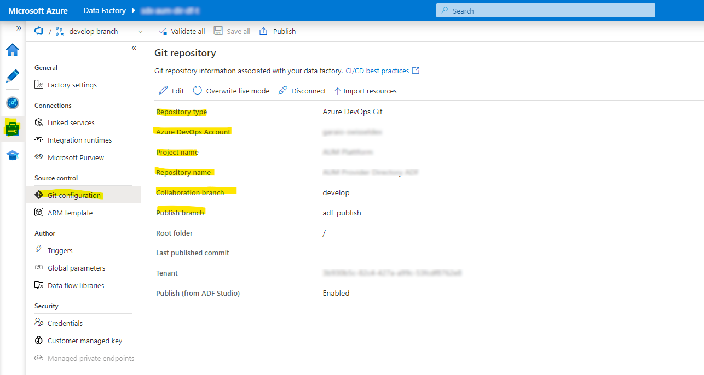

# Introduction

When implementing an Azure Data Factory based application with multiple deployment stages (aka environments, such as DEV, TEST, INT, PROD), the recommended approach is to implement a [Continuous integration and delivery process based on a GIT repository](https://learn.microsoft.com/en-us/azure/data-factory/continuous-integration-delivery). The development instance is linked to a GIT repository, each change will create a new commit on save and the publishing function generates an ARM template in a dedicated branch (of that GIT repo), which can be used for deployment of other environments.

> Note that ARM/Bicep deployments can only be done when triggers are in disabled state, so basically you need to toggle the status before and after a deployment. Additionally there is no possibility to manage trigger status in ARM/Bicep definitions. We use this DevOps Extension [`Azure Data Factory`](https://marketplace.visualstudio.com/items?itemName=liprec.vsts-publish-adf), which allows a simple enabling/disabling of specific triggers or all existing.

# Setup

Deploy first the Data Factory development environment (e.g. by using the provided Bicep definition) and create the additional GIT repository in the DevOps Project. Then link this repository in the [ADF Designer](https://adf.azure.com) as follows:



At best you then make some initial definitions and publish the state to the GIT repository. You can then check and compare the configurations in this template and adjust it accordingly.

# Deployment

In the CI pipeline we download the currently published state from the ADF-linked repository and add it to the artifact (from [`azure-pipelines.ci`](./azure-pipelines.ci.yml)):

```yaml
        # Step required when using multiple repo's: https://docs.microsoft.com/en-us/azure/devops/pipelines/repos/multi-repo-checkout
        - checkout: self
          clean: true
          path: 's' # Re-set default directory

        - task: CopyFiles@2
          displayName: 'Copy Deployment Definitions (to be included in Artifact)'
          inputs:
            SourceFolder: '$(deploymentFolderName)'
            TargetFolder: '$(Build.ArtifactStagingDirectory)/$(deploymentFolderName)'
            
        - checkout: 'git://$(System.TeamProject)/$(adfRepoName)@$(adfRepoBranch)'
          displayName: 'Download ADF ARM Template from its repository'
          condition: and(ne(variables.adfRepoName, ''), ne(variables.adfRepoBranch, ''))
          clean: true
          path: 's/$(adfRepoPath)'

        - task: CopyFiles@2
          condition: and(ne(variables.adfRepoName, ''), ne(variables.adfRepoSourceProjectName, ''))
          displayName: 'Copy ADF ARM Template (to be included in Artifact)'
          inputs:
            SourceFolder: '$(adfRepoPath)/$(adfRepoSourceProjectName)'
            Contents: |
              $(adfTemplateFilename)
            TargetFolder: '$(Build.ArtifactStagingDirectory)/$(adfTemplateFolder)'
            OverWrite: true

        - task: PublishPipelineArtifact@1
          displayName: 'Publish Artifact'
          inputs:
            targetPath: '$(Build.ArtifactStagingDirectory)'
            artifactName: '$(System.StageName)'
```

During the deployment, the whole artifact is published to a Storage Account (details see [`templates.deploy-to-stage.yml`](./templates.deploy-to-stage.yml)). This makes the ARM template of the ADF content accessible by URL as follows (from [`azuredeploy.bicep`](./Deployment/azuredeploy.bicep)):

```typescript
param isAdfDevelopmentStage bool = false
param adfRepoName string = 'Demo Project ADF'
param adfRepoDevOpsProjectName string = 'Demo Project'
param adfRepoDevOpsOrgName string = 'garaio-customer'
...
var dataFactoryContentsDefinitionUri = '${storageAccountBlobUri}${blobContainerDeployment}/Swisseldex.AUM.Deployment/DataFactoryDefinitions/ARMTemplateForFactory.json'
...
resource dataFactoryRes 'Microsoft.DataFactory/factories@2018-06-01' = {
  name: dataFactoryName
  location: resourceLocation
  properties: {
    repoConfiguration: !isAdfDevelopmentStage ? null : {
      type: 'FactoryVSTSConfiguration'
      accountName: adfRepoDevOpsOrgName
      projectName: adfRepoDevOpsProjectName
      repositoryName: adfRepoName
      collaborationBranch: 'develop'
      rootFolder: '/'
    }
  }
  identity: {
    type: 'SystemAssigned'
  }
}

resource dataFactoryContentsRes 'Microsoft.Resources/deployments@2021-01-01' = if (!isAdfDevelopmentStage) {
  name: 'DataFactoryContents'
  properties: {
    mode: 'Incremental'
    templateLink: {
      uri: '${dataFactoryContentsDefinitionUri}?${listAccountSas(storageAccountRes.id, '2021-06-01', storageAccountBlobSasParams).accountSasToken}'
    }
    parameters: {
      factoryName: { 
        value: dataFactoryName
      }
      AzureKeyVault_properties_typeProperties_baseUrl:  { 
        value: 'https://${keyVaultName}${environment().suffixes.keyvaultDns}/'
      }
      // Extend with additional custom parameters
    }
  }
}
```

# Further

May be interesting: https://learn.microsoft.com/en-us/azure/data-factory/continuous-integration-delivery-improvements