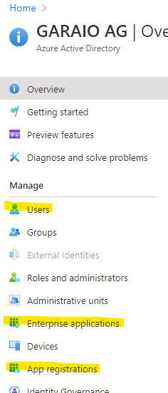

# Introduction
## Theory
In the Azure ecosystem the access to API's is often managed with Active Directory objects and assigned permissions. These API's may be custom endpoints or endpoints for a bunch of Microsoft applications such as DevOps, Dynamics 365, Power Platform applications, OneNote ... but in most situations just the Microsoft Graph which is the consolidated access to almost any data. To manage permissions for those API's, there are three different identity representations in the AAD:
* Users
* Service principals / Managed Identities -> In the AAD these can be found in the section "Enterprise Applications"
* App Registrations

The access to an API can be done in two different ways (which is important to understand):
* Delegated (sometimes also "on-behalf-of"): In the name of the user which calls / triggers the process. This always (at least to what the author is aware of) happens within a HTTP context (e.g. Functions with HTTP trigger)
* Application: The application connects to an API independent of users and user interactions, which is often the case for background jobs such as e.g. data synchronisations. This can be realized in any Function context, often Timmer triggered functions are used.

App Services and Functions has two built-in capabilities to generate an authentication / authorization context which can be used as basis to establish access to API's:
* **Managed Identity**: This is comparable to the "run as" functionality in non-cloud runtime environments (e.g. IIS Application Pool identity). The only difference between system-assigned and user-assigned identities is that the latter shifts the lifetime management to you. Both share the disadvantage that the assignment of API Permissions is not easily possible (via REST API or PowerShell only), which makes a deployment complicated and cumbersome if an admin consent is required for the permissions (which is almost always the case for Application-based permissions). Additionally, if you use a combination of system- and user-assigned identities or multiple user-assigned identities you must select the identity to be used in the code.
* **Built-in authentication**: This is a layer around the execution context of a Function or App Service and can enforce the caller to deliver a valid authentication and then makes this token directly usable in code (dependency injection). Therefore, a bunch of identity providers can be configured (very similar to External Identities in AAD B2B / B2C). This [built-in authentication](https://docs.microsoft.com/en-us/azure/app-service/overview-authentication-authorization) is sometimes referred to as "Easy Auth" and is mainly intended to authenticate the caller (i.e. user, delegated access) - but as this snippet shows it can be easily and neatly used to obtain tokens for application-based access. When using AAD as an Identity Provider, it completely bases on an App Registration which can be created in advance and then provided to a "continuous" style deployment.
* _Custom implementation_: Many examples (even from Microsoft) propagate the manual configuration of the App Registration details and based on that a manual token management with e.g. the MSAL library. This is possible but not necessary.

## Recommendations

| Approach | Delegated ("on-behalf-of") | Application ("background-job") | Recommendations |
|----------|--------------------------|------------------------------|-----------------|
| Managed Identity | Not Feasible | Supported | Use it for connections which do not rely on configured API permissions, but role assignment based on AAD identity. Mostly for access to other Azure Services (e.g. Key Vault or Databases). Use user-assigned identities only if the reuse of an identity is beneficial (e.g. load balancing scenarios) and the clean-up is ensured. |
| Built-In Auth | Favoured | Supported | Use it for delegated scenarios whenever possible and elaborate proper configuration of unauthenticated access. Use it for application-based access if it based on API permissions (such as with Microsoft Graph), especially if you have both delegated and application-based access to resources. |

# Getting Started
Create an App Registration and assign in to Function (you may take [`azuredeploy.json`](./azuredeploy.json) as a basis). Create an additional secret on it and copy the according settings to `local.settings.json` (avoid to commit sensitive data to the source management).

## Code
The snippet provides do slightly different solutions represented by the two functions in the Function App. Both also work locally on a deployment machine without any special measures other than the configuration.
* [AccessGraphWithSimpleAuth](./FunctionApp/Functions/AccessGraphWithSimpleAuth.cs)
* [AccessGraphWithMsal](./FunctionApp/Functions/AccessGraphWithMsal.cs)

## Deployment (Azure Resources)

# Further Reading
## Built-In AuthN / AuthZ
* [MSDN Authentication and authorization in Azure App Service and Azure Functions](https://docs.microsoft.com/en-us/azure/app-service/overview-authentication-authorization)

## Alternative Approach using Managed Identities
* [MSDN How to use managed identities for App Service and Azure Functions](https://docs.microsoft.com/en-us/azure/app-service/overview-managed-identity?tabs=dotnet)
* [MSDN Tutorial: Access Microsoft Graph from a secured app as the app](https://docs.microsoft.com/en-us/azure/app-service/scenario-secure-app-access-microsoft-graph-as-app?tabs=azure-powershell%2Ccommand-line)

## Generate Access Token for delegated / on-behalf-of Access
* [MSDN Tutorial: Build Azure Functions with Microsoft Graph](https://docs.microsoft.com/en-us/graph/tutorials/azure-functions)
