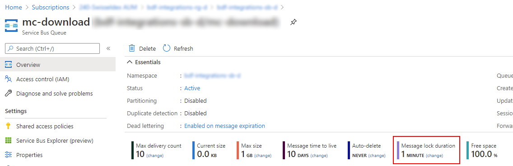
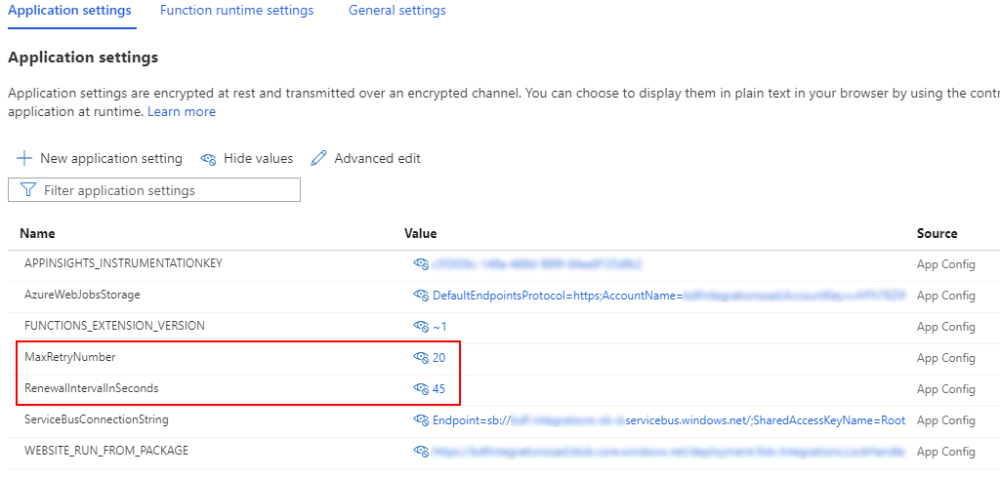
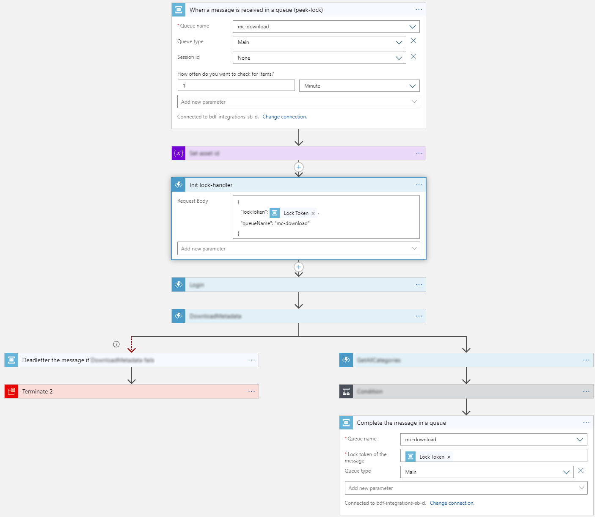

# Introduction
In integration scenarios, a common pattern is to use a Service Bus to manage asynchronous processing of integration tasks (realised with e.g. Logic Apps). When using the more robust peek-lock mechanism, the lock duration may end before before a long during process has completed (which leads to concurrent re-handling of the message). With this handler running in the background, this is efficiently avoided, as the lock is renewed before expiry.

With Azure Service Bus you can follow two different strategies for consumation of messages:
1. Auto-completing: Despite no expiration-problems occur, you have to handle the situation that the logic app may fail or the connectivity may be interrupted. You may try to re-add the message to the queue, but it may be complex to handle every potential case in the process, as well as it may cause problems in the history of the messages
1. Peek-lock: In that case, the message is marked as reserved on initial consumation and then manually completed, abandoned or dead-lettered. This is generally the most stable pattern and chosen strategy for the solution of this snippet.

Notes:
* The renewal of the lock could be done directly in the Logic App (the Service Bus connector has an according endpoint). Problem is, that the expiration may occur anywhere in the process and even a single step may take longer than the lock duration
* The completion of the message should be done at the very end of a Logic App process, as the resubmit in case of errors may fail otherwise (message does not exist anymore in the queue)
* You may need to configure and optimize the [concurrency for the Logic App trigger](https://docs.microsoft.com/en-us/azure/logic-apps/logic-apps-workflow-actions-triggers#change-trigger-concurrency)

# How it works
1. When a message is consumed with peek-lock you get a token which can be used to prolongate the lock duration
1. This token (along with the Queue information) is sent to a durable function, which then automatically starts a background process running in a configured intervall
1. In that process the message lock is extended using the given information
1. As soon as the process is stopped by calling an according HTTP endpoint (again from the Logic App), the Service Bus returns an error as the message has been removed or a configured amount of executions is reached, this background process automatically stops
1. In the case that the process stops because the maximal amount of lock prolongations has been reached, the message lock expires and the message will be available again for consumers. This case has to be foreseen and the according configurations have to be aligned (i.e. number of prolongations * intervall has to be slightly bigger than the maximal duration of the Logic App, given by the sum of timeout configuration on the single steps).

# Getting Started
Check the settings in the according Service Bus Queue regarding the lock duration:

Deploy the lock handler function an ensure that the configurations are appropriately set. The renew intervall must be smaller as the configured lock duration:

You may then reference the lock handler function with a function connector reference early in the process. This shows a minimal realisation:

In this sample implementation, the lock renewal is not explicitely stopped. The lock handler function automatically detects that the message has been handled and aborts its process. Alternatively you may explicitely stop it with an additional step in the Logic App.

# References
* [MSDN Overview Durable Functions and Usage Patterns](https://docs.microsoft.com/en-us/azure/azure-functions/durable/durable-functions-overview?tabs=csharp#application-patterns)
* [MSDN Azure Service Bus Connector Details (for Logic Apps)](https://docs.microsoft.com/en-us/azure/connectors/connectors-create-api-servicebus)