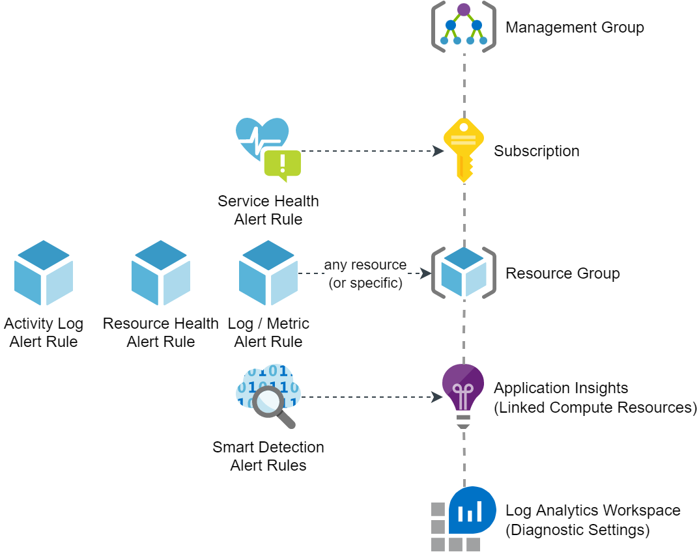

# Overview

These are some key principles:
* Oriented to consumers of alerts: How needs which information in which form?
* Notification and escalation based on RBAC and appropriate tools (such as ticketing system and backlog management system) instead of using specific user accounts (based on email address or phone number): The alert notifications shall be independend from persons and allow simplified management
* Standardisation: 

# Knowledge

## Alert Rule Types

## Activity Log Alerts

## Service Health Alerts

## Resource Health Alerts

## Smart Detection Alerts

## Availability Test Alerts
These are basically just regular metric alerts, but created with and referencing a specific Availability Test, which is a great built-in feature of Application Insights.

## Custom Alerts (log- or metric-based)

# Application Guidelines
The following checklist (or task list) can be used to define guidelines for review and handover of applications.

1. Roles assigned on the subscription
1. Standard alert rules deployed
1. Availability tests defined (appropriate to measure SLA definitions)
1. Custom Alerts and steps to remedy documented in operations manual (or in another part of the application documentation)

# Resources
* [MSDN Overview of Azure Alerts](https://learn.microsoft.com/en-us/azure/azure-monitor/alerts/alerts-overview)
