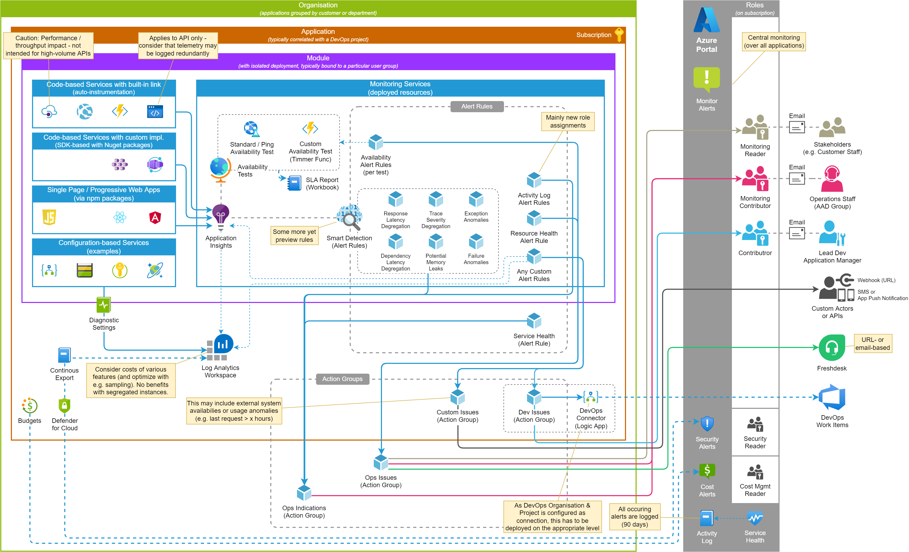
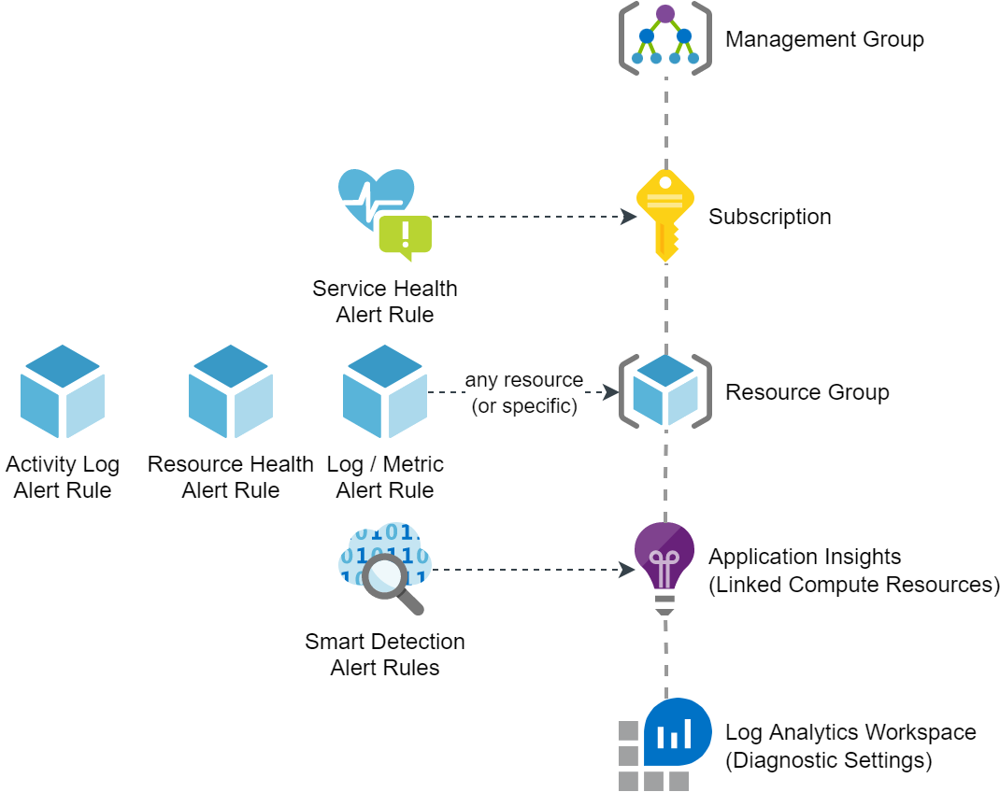
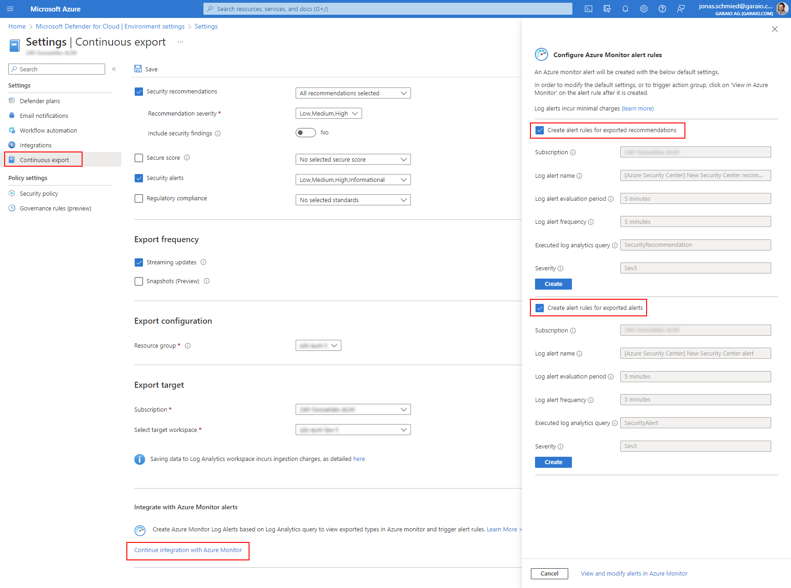
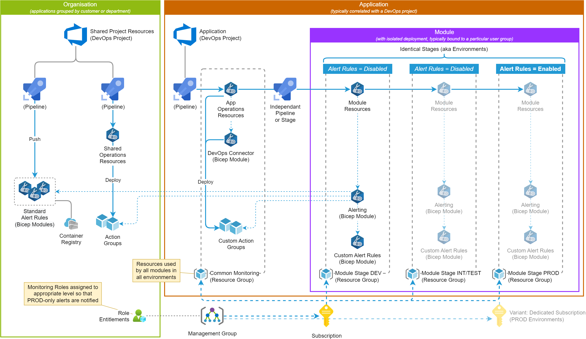

# Overview
Running PaaS applications on Azure is typically a low-labor affair. Properly configured, the resources used are usually self-managing. A [wide variety of monitoring options](../../Knowledge/BestPractices-AzureSolutions-Monitoring) are available and the operations manager could rely on the occasional analysis of Azure Monitor reports and dashboards. However, this has the following problems:
* Critical operational problems are discovered too late (mostly by users).
* Without in-depth application knowledge, the Azure Monitor information is too complex, and relevant correlations for proactive measures (e.g. scaling) are difficult to derive.

This alerting concept is based on the following goals and principles:
* Multiple applications are operated within an organization.
* Basically designed for DevOps teams, nevertheless a certain division of development-specific and operational incidents is aimed at. On the one hand, a Service Level Agreement (SLA) should be guaranteed, on the other hand, a continuous quality improvement should be supported.
* **All important incidents are automatically recorded and output as alerts. A proactive, sporadic analysis of the monitoring information is therefore not mandatory (but nevertheless useful)**. The alerts view in the portal thus provides a centralized view for the relevant applications for all roles.
* Alert rules are defined as standardized as possible so that applications are monitored as similarly as possible. Overall, the effort required to set up each application should be minimal.

These are some key principles:
* Oriented to consumers of alerts: How needs which information in which form?
* Notification and escalation based on RBAC and appropriate tools (such as ticketing system and backlog management system) instead of using specific user accounts (based on email address or phone number): The alert notifications shall be independend from persons and allow simplified management.
* Standardisation: There are many highly standardized Alert Rule definitions, that can be referenced via Bicep Modules.

# Knowledge

How alerts are defined and processed in general (source MSDN, see link in resources below):

## Alert Rule Types

As already shown in the overview diagram, there are different alert types in Azure, which are defined in different ways (for example, Security Alerts from Defender standard plans or Cost Alerts on Management Groups, Subscriptions or Resource Groups). For application monitoring, the [Monitor Alerts group](https://learn.microsoft.com/en-us/azure/azure-monitor/alerts/alerts-types) is primarily important, which can have the following subtypes:

Not shown in the above diagram are certain [special features of Metric Alert Rules](https://learn.microsoft.com/en-us/azure/azure-monitor/alerts/alerts-metric-multiple-time-series-single-rule). Especially important is that certain metrics can only be issued for a specific resource (i.e. one alert rule per resource is needed), while other metrics can be defined for a resource type and a scope (usually Resource Group) (i.e. one alert rule can monitor all resources of a type).

## Activity Log Alerts

Every changing user interaction is recorded, furthermore relevant events of other management services (e.g. Defender) are automatically logged in the Activity Log. Most of these entries can be used as triggers for alerts, the specific events depend on the resource type.

The [Activity Log triggers are divided into several categories](https://learn.microsoft.com/en-us/azure/azure-monitor/essentials/activity-log-schema), two of which are further explained in the subsections below.

Default rules:
* New role assignments applicable to Resource Group

Recommendations:
* Reluctant use because many signals occur frequently and usually have little relevance for operational safety
* Depending on the governance of the organization with many `Audit` and `Deny` type policy assignments, an alert for these events may be useful

### Service Health Alerts

This is a sub-type of an Activity Log Alert and can be created for the scope of a subscription only. It informs about general issues for resource types and their regions which matches to one or more resources deployed in the subscription. These resources are likely, but not necessarily impacted by the issue. If they are impacted, a Resource Health Alert will be fired too (if the Alert Rule is deployed), in that case the additional Service Health Alert may give some more context information.

Standard Alert Rules:
* Subscription-related incidents on matching resource types and regions

### Resource Health Alerts

This also is a sub-type of Activity Log Alerts and can be created on any level in the hierarchy. It informs about configured changes of the availability status (on the level of the Azure platform). If no redundancy is forseen, this marks an outage of the application component.

Standard Alert Rules:
* Resource Group resource becomes either `Degraded` or `Unavailable`

## Smart Detection Alerts

Application Insights content is monitored by default for anomalies and unusual relative changes. This can, for example, provide indications of faulty releases or open security risks in the application. Meanwhile, [these analysis rules can be distributed (or migrated) as regular alert rules](https://learn.microsoft.com/en-us/azure/azure-monitor/alerts/alerts-smart-detections-migration), so the usual options for notification and further processing are available.

Standard Alert Rules:
* Migration of all available Smart Detection Rules for an Application Insights instance

## Availability Test Alerts

These are basically just regular metric alerts, but created with and referencing a specific Availability Test, which is a [great built-in feature of Application Insights](https://learn.microsoft.com/en-us/azure/azure-monitor/app/availability-overview). These alerts are usually the most critical, as they inform about a specific outage.

Standard Alert Rules:
* _none_

Recommendations:
* Define an Availability Test along with its Alert Rule for each relevant API endpoint resource (e.g. App Service or Container App), at best including the whole propagation path (e.g. API Management, Front Door)

## Custom Alerts (log- or metric-based)

Metrics alert rules are directly available for all resources (Azure Monitor), log-based alert rules can be applied to Application Insights and Log Analytics workspaces. Typical [monitoring scenarios are listed in this snippet](../../Knowledge/BestPractices-AzureSolutions-Monitoring).

Standard Alert Rules:
* _Most of the above recommended cases_

Recommendations:
* Analyze which resources do not have an auto-scaling behaviour and thus may encounter a capacity limitation
* Analyze the data and integration workflows in the application and check if there may be situations that should fire an alert (e.g. Service Bus Dead Letter Queueing)
* Analyze the defined non-functional requirements (i.e. performance and quality goals) and ways to measure according discrepancies

## Security Alerts (or Alerts generated from Recommendations)

Security Alerts from Defender are generated only in paid plans (available for some Resource Types). If so, they are raised as specific type viewable only in Defender (i.e. not as Monitor Alerts). It is possible to [export security data consisting of recommendations and alerts continuously to a Log Analytics Workspace](https://learn.microsoft.com/en-us/azure/defender-for-cloud/continuous-export?tabs=azure-policy#exporting-to-a-log-analytics-workspace). Based on that, it is possible to raise Monitoring Alerts for new alert or recommendations entries (custom log-based alert rule). Beside the consistent view and handling achieved doing that, it may be especially helpful to ensure the responsible developer / application provider gets notified.

To be considered: This solution can only be set up on the level of the subscription, only once and not via ARM/Bicep as of current knowledge. When having multiple application components or even multiple environment deployments in the same subscription, this would require a clean structuring and deployment concept (which is not further evaluated in this template).

When setting up the continous export in the Azure Portal, Alert Rules for both alerts and recommendations can be generated directly:

# Application Guidelines
The following checklist (or task list) can be used to define guidelines for review and handover of applications.

1. Roles assigned on the subscription
1. Standard alert rules deployed
1. Availability tests defined (appropriate to measure SLA definitions)
1. Custom Alerts and steps to remedy documented in operations manual (or in another part of the application documentation)
1. _When reasonable: DevOps connection (aka "handler") deployed and initialized with user authentication_

## Deployment Concept (Recommendation)

For consistency and testing, it is recommended to deploy all alerting resources also on non-production environments, but disable the Alert Rules on these environments so that no Alerts are fired.

## Samples & Templates for Standard Alert Rules

_coming soon_

# Resources
* [MSDN Overview of Azure Alerts](https://learn.microsoft.com/en-us/azure/azure-monitor/alerts/alerts-overview)
* [MSDN Built-in Roles with its GUIDs usable to link Action Groups](https://learn.microsoft.com/en-us/azure/role-based-access-control/built-in-roles)