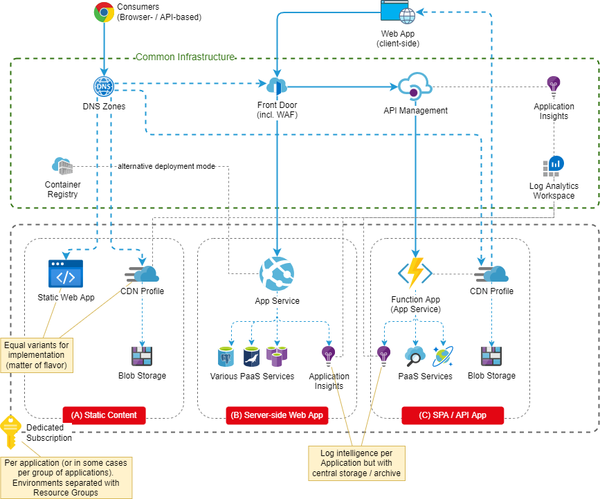
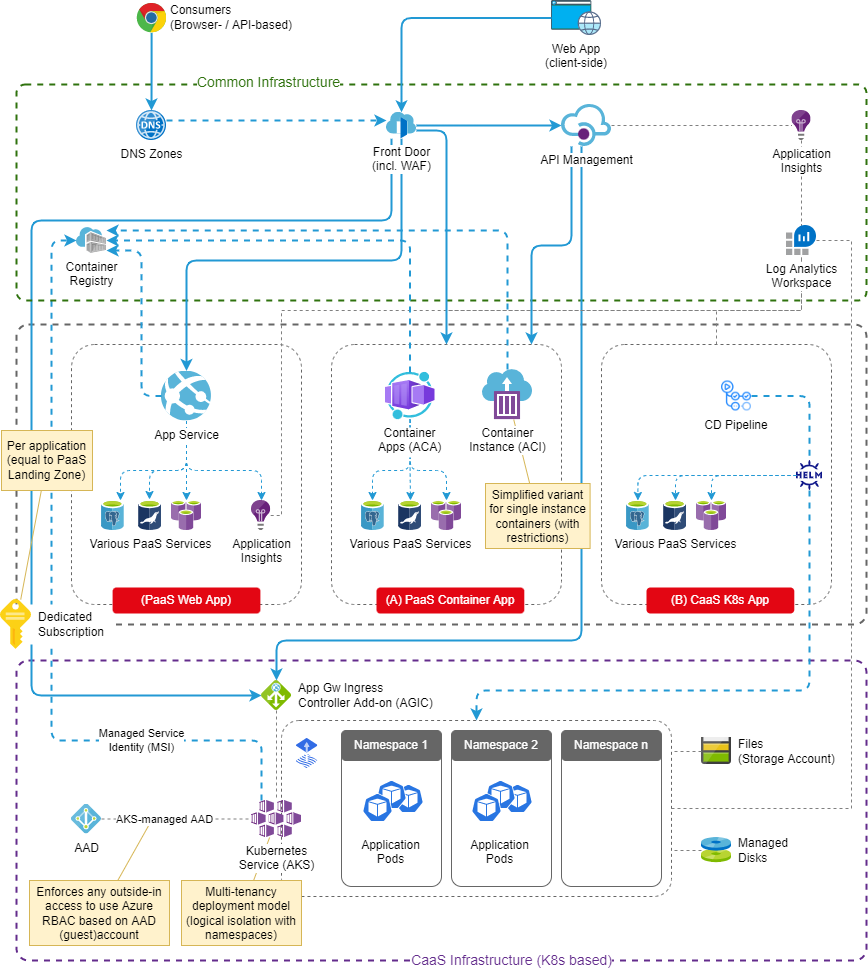

# Overview
For companies introducing Azure as platform for custom applications, it is often helpful to prepare and document reference architectures with some base resources to rely on.

The content below provides a simple implementation of [the concept known from the Cloud Adoption Framework](https://docs.microsoft.com/en-us/azure/cloud-adoption-framework/ready/landing-zone/), giving guidelines to migrate or newly realise PaaS or CaaS applications.

# Landing Zone PaaS Applications

> [Draw.io Template LandingZones](https://github.com/garaio/AzureRecipes/raw/master/Templates/Guideline-ApplicationLandingZones/LandingZones.drawio)

Application types other than Web or API apps can be implemented in the same way by adapting the patterns accordingly (e.g. dedicated Subscription). A typical use case would be data integration processes (implemented with Logic Apps or Data Factory).

# Landing Zone CaaS Applications

> [Draw.io Template LandingZones](https://github.com/garaio/AzureRecipes/raw/master/Templates/Guideline-ApplicationLandingZones/LandingZones.drawio)

Container as a Service application architectures require a prepared runtime infrastructure based on Kubernetes. The Azure Kubernetes Service is a highly managed service, which simplifies the  deployment and of nodes, accessibility and various integration aspects. Nevertheless, it is more complicated regarding deployment processes and operational tasks than PaaS architectures.
Nevertheless Docker containers can be run with a growing choice of pure PaaS services, whereas one of them is the Azure App Service already visualized in the Landing Zone PaaS. Other options are:
* [Azure Container Apps](https://azure.microsoft.com/en-us/services/container-apps): Orchestrated container apps with a fully managed PaaS serverless service. This is currently in preview state (i.e. not for production use cases) and not yet available in the region Switzerland North.
* [Azure Container Instance](https://azure.microsoft.com/en-us/services/container-instances): This is a simple variant to run single instances of containers (or container groups). The main advantages compared to App Services is its availability for non-HTTP connections and its runtime behaviour (fast startup, automatic stop when logic is executed). When providing an API, it is to consider that it lacks some functionality which is built-in in App Services, such as TLS (for HTTPS), user authentication and sophisticated monitoring and logging functionality. This leads to some complexity for developers (for example TLS must be implemented with a sidecar container).
