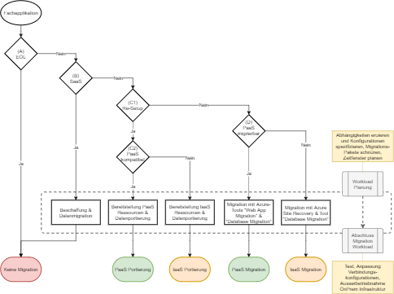
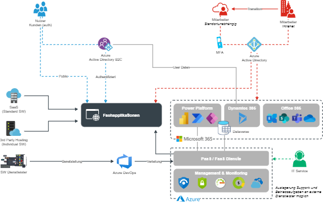
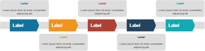
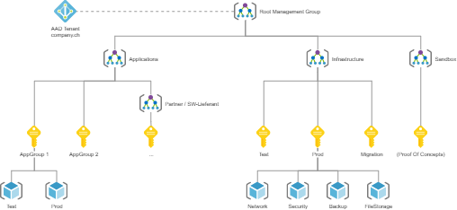
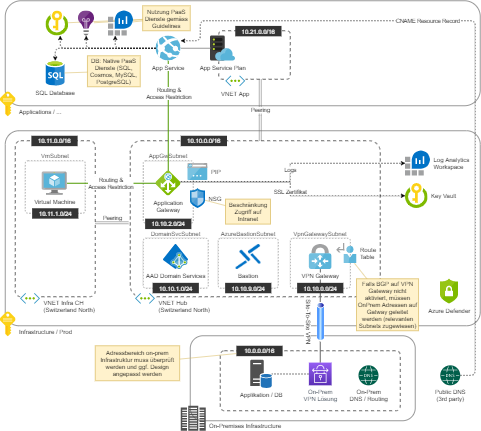

# Overview
In order to implement a cloud strategy in a company, existing IT infrastructures and applications often have to be migrated systematically and well planned into the cloud environment. The [Microsoft Cloud Adoption Framework](https://docs.microsoft.com/en-us/azure/cloud-adoption-framework/operating-model) provides a good basis to plan and realize such a journey. This folder contains various templates for visualisation, planning and decision-making which may be used to support this journey.

_Note: The contents are mostly in German_

# Contents
## Application Catalog
One of the first steps is often the creation of an inventory of the existing applications. This is the basis to:
* define the scope for migrations
* define the target zone and the measures to reach it
* group workloads and plan phases

> [Excel Template](https://github.com/garaio/AzureRecipes/raw/master/Templates/Miscellaneous-CloudMigrationResources/Migrationen-Applikationskatalog.xlsx)

## Decision Matrix
To systematically evaluate the measures to modernize or migrate single applications, a simple decision tree and according checklist may be helpful.

_Note: Consider the integration of business responsibles into that process_

> [Excel Template Checklist/Matrix](https://github.com/garaio/AzureRecipes/raw/master/Templates/Miscellaneous-CloudMigrationResources/Migrationen-Entscheidungsmatrix.xlsx)

> [Draw.io Template Decision Tree](https://github.com/garaio/AzureRecipes/raw/master/Templates/Miscellaneous-CloudMigrationResources/Migrationen-Visualisierungen.drawio)

## Vision & Roadmap
In order to communicate the vision in a comprehensible way, it often helps to visualise the target status at different points in time (e.g. in 1, 2, 5 years) and to present the measures for this on a time axis.

 

> [Draw.io Template Visualisations](https://github.com/garaio/AzureRecipes/raw/master/Templates/Miscellaneous-CloudMigrationResources/Migrationen-Visualisierungen.drawio)

## Basis Infrastructure
In preparation for migrations, some general concepts often need to be established. These are typically:
* Management structures (subscriptions, roles and responsibilities)
* Network design and infrastructure, especially if a systematic connection to local networks or networks in other cloud environments is to be realised
* General security concepts
* General backup & disaster recovery concepts

 

> [Draw.io Template Visualisations](https://github.com/garaio/AzureRecipes/raw/master/Templates/Miscellaneous-CloudMigrationResources/Migrationen-Visualisierungen.drawio)
